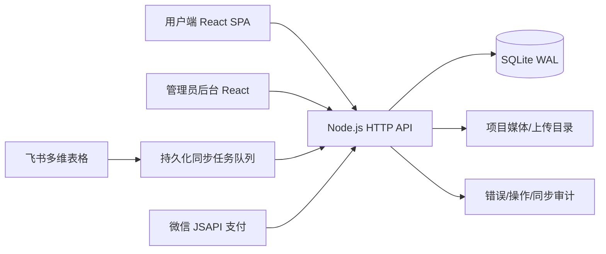
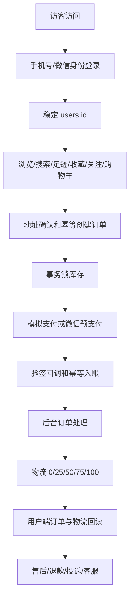
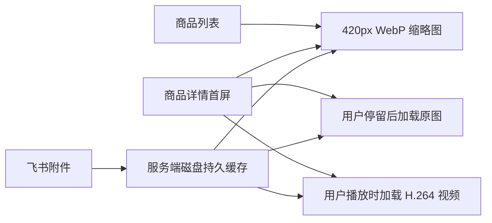

# 福宠项目恢复基线（2026-07-15）

本文档以 2026-07-15 当前代码、数据库迁移 001—022 和顶置任务已完成历史为准，用于后续直接续接开发。旧报告中仅到迁移 009 的内容已过期。

## 1. 总体架构

- 前端：React 19、TypeScript、Vite；用户端和 `#admin` 管理后台共用一个 SPA。
- 后端：Node.js 原生 HTTP 服务；统一访问 SQLite，使用参数化 SQL 和增量迁移。
- 数据库：`server/data/fuchong.db`，WAL、外键、busy timeout、启动备份和一致性审计。
- 媒体：商品媒体支持本地上传及飞书代理；商家实景使用 `public/merchant` 稳定资源，不再依赖微信临时路径。
- 外部集成：飞书多维表格已真实验证；微信支付代码链已完成，真实支付依赖商户凭据和公网 HTTPS。

## 2. 当前业务闭环

同一手机号重复登录返回同一用户，收藏、购物车、地址、订单、支付、物流、消息继续归属原 `users.id`。游客数据可合并到正式用户；购物车具有数据库真值和按用户隔离的本地缓存；订单使用 `client_request_id` 防止重复创建和重复锁库存。

## 3. 前端模块

| 区域 | 页面/能力 | 状态 |
|---|---|---|
| 市场 | 首页、六大场馆、品种列表、分页搜索 | 已完成 |
| 商品 | 详情、图/视频轮播、档案、品种特征、父母信息、评价 | 已完成 |
| 商家 | 20 个商家、信任度、门店资料、实景缩略图/大图、24 条评价展示、关注、举报、咨询 | 已完成 |
| 用户 | 登录、资料、收藏、足迹、地址、优惠券、订单、消息 | 已完成 |
| 交易 | 购物车、地址确认、下单、支付、取消、物流、售后 | 已完成；真实微信凭据待部署配置 |
| 内容 | 公益、照护地图、协议、隐私、设置 | 已完成 |
| 管理后台 | 仪表盘、商品、库存、用户、订单、物流、交易、售后、内容、评价、飞书、日志 | 已连接真实 API |

核心文件：

- `src/App.tsx`：用户端页面状态、商品详情、商家详情和主导航。
- `src/UserModules.tsx`：登录、收藏、足迹、地址、优惠券、订单和消息。
- `src/P0Modules.tsx`：兼容的关键用户流程模块。
- `src/Admin.tsx`：管理员后台。
- `src/cartStore.ts`：按用户隔离的购物车缓存和服务端合并。
- `src/domain.ts`、`src/catalog.ts`：领域数据与场馆/品种目录。

## 4. 后端接口分组

### 用户与身份

- `POST /api/users/login`
- `GET/PATCH /api/users/:id`
- `PATCH /api/users/:id/bind-phone`
- `POST /api/users/:id/auth`
- `GET /api/users/:id/summary`
- `POST /api/visitors/session`

### 商品、商家与行为

- `GET /api/pets`、`GET /api/pets/:id`
- `GET /api/categories`
- `GET /api/sellers/:id`
- `POST /api/sellers/:id/reports`
- `GET/POST/DELETE /api/favorites`
- `GET/POST/DELETE /api/follows`
- `GET/POST/DELETE /api/footprints`
- `GET/POST/DELETE /api/cart`、`POST /api/cart/merge`

### 地址、订单、支付、物流与售后

- `GET/POST/PATCH/DELETE /api/addresses`
- `GET/POST /api/orders`、`GET /api/orders/:id`
- `PATCH /api/orders/:id/cancel`
- `POST /api/payments/mock`
- `POST /api/payments/wechat/prepay`
- `POST /api/payments/wechat/notify`
- `POST /api/after-sales`、`POST /api/complaints`
- `GET/POST /api/messages`

### 管理后台

- `POST /api/admin/login`、`GET /api/admin/stats`、`GET /api/admin/db/status`
- 商品、SKU、库存、媒体 CRUD
- 用户、订单、交易、物流、售后、投诉、商家举报管理
- Banner、分类、优惠券和评价管理
- 飞书配置、测试、预览、确认、暂停、继续、重试、错误明细
- 管理员操作日志和 API 错误日志

## 5. 数据库分区

| 数据域 | 关键表 |
|---|---|
| 用户身份 | `users`、`user_auth`、`user_login_logs`、`visitors` |
| 用户行为 | `favorites`、`follows`、`footprints`、`cart_items`、`addresses` |
| 商品与品种 | `categories`、`breeds`、`pets`、`pet_products`、`pet_skus`、`inventory` |
| 商品媒体 | `pet_images`、`pet_videos` |
| 商家 | `sellers`、`seller_reviews`、`seller_reports` |
| 交易 | `orders`、`order_items`、`order_status_history`、`payments` |
| 物流售后 | `logistics`、`logistics_events`、`after_sales`、`complaints` |
| 客服营销 | `customer_service_sessions`、`messages`、`coupons`、`user_coupons` |
| 内容运营 | `banners`、`categories`、`product_reviews` |
| 飞书同步 | `feishu_sync_configs`、`feishu_sync_previews`、`feishu_sync_tasks`、`feishu_sync_task_items`、`sync_task_errors` |
| 审计运维 | `admins`、`admin_operation_logs`、`api_error_logs`、`schema_migrations` |

迁移 021 完成用户数据、购物车、订单幂等和同步任务一致性；迁移 022 为 20 个商家关联稳定实景图片，并把每家实际评价记录补足到 128 条；迁移 023 为访客归属、售后、用户登录日志和飞书任务增加大数据查询索引；迁移 024 约束每个用户唯一默认地址、每个订单唯一进行中售后，并补齐客服、评价用户索引。

## 6. 顶置任务进度同步

### 已完成

- 保留原用户端视觉结构并修复底部导航、场馆和地址输入。
- 用户、商品、订单、支付、物流、后台、售后、优惠券形成真实数据闭环。
- 同手机号登录恢复全部用户数据；购物车按用户隔离并可合并。
- 用户身份变化通过统一事件实时通知页面；用户接口不再缺省读取 1 号用户，缺少身份会明确返回 400。
- 游客登录合并后，收藏、关注、购物车只保留在目标用户，订单、地址、消息、售后、投诉与评价完整转移。
- 商品名去重、每个商品有评价、品种特征和商家信任度已补齐。
- 飞书真实表结构、4 条真实记录及 5,000 条模拟批量同步已验证。
- 订单幂等、库存锁定/释放、支付幂等、物流事件、退款状态已验证。
- 飞书每条记录使用独立保存点，单行失败会完整回滚该行，不能留下半条商品、媒体或库存数据。
- 物流、订单状态、物流事件和库存释放使用同一事务；售后申请与订单状态也使用同一事务。
- 物流状态固定为 0/25/50/65/75/90/100 规范节点，禁止未付款发货、进度倒退和重复写入同一物流事件。
- 用户“待收货”统一归并已发货、运输中、配送中、待收货状态，并展示 0/25/50/75/100 分段物流车进度。
- 20 张商家图片已生成详情图和缩略图，并转存到项目稳定资源。
- 20 个商家均有实际评价总数 128，详情接口返回最新 24 条。

### 部署前必须配置

- `ADMIN_TOKEN_SECRET`：生产管理员令牌密钥。
- `FEISHU_APP_ID` / `FEISHU_APP_SECRET`：飞书真实同步。
- `WECHAT_PAY_*`：商户号、证书、APIv3 密钥和 HTTPS 回调。
- `VITE_API_BASE` / `PUBLIC_API_BASE`：部署域名和公开媒体地址。

### 后续优先级

1. P0：用户 access token 和资源所有权中间件，替换公网场景直接信任 `user_id`。
2. P0：真实微信 JSAPI 支付、退款和低金额实单验收。
3. P1：对象存储/CDN、病毒扫描、图片与视频异步转码。
4. P1：飞书任务拆分独立 worker，增加 Redis/队列监控。
5. P2：RBAC、多商家租户、营销活动、推荐和数据仓库。

## 7. 每次续接的验收顺序

1. `git status --short`，保留用户未提交修改。
2. `npm run lint`。
3. `npm run build`。
4. `npm test --prefix server`（只使用临时测试库）。
5. 检查 `/api/admin/db/status`、外键和备份。
6. 浏览器验证首页、场馆、商品详情、商家详情、订单和后台。
7. 未经用户明确要求，不执行 Git 提交或推送。

## 8. 从顶置任务恢复出的长期用户偏好

- 必须在现有代码和 UI 上增量开发，不推倒重做，不大范围重构，不删除已有正常功能。
- 数据安全高于开发速度：禁止清空或重新初始化真实数据库；所有结构变更使用增量 migration，变更前保留备份。
- 用户端保持奶油白、白色圆角卡片、柔和阴影、清晰层级和 Apple 式克制风格；避免淘宝/拼多多式拥挤，不出现无意义英文、乱码和测试占位文案。
- 首页六个场馆保持双列关系；底部导航固定为“市场 / 宠物家 / 客服 / 我的”。
- 品种图与具体商品实拍严格分离：品种页可以使用标准品种肖像；商品橱窗和详情必须使用后台或飞书上传的对应宠物实拍，不能拿品种图冒充商品图。
- 商品详情需要保留图片/视频、档案、品种特征、毛色、体型、毛发、性格声音、成长记录、起源地图、父母信息、商家信任、评价、收藏、购物车、购买和客服完整链路。
- 前端流畅性是长期 P0：列表首屏 12 条、分页/懒加载/虚拟列表、缩略图优先、详情框架先开、高清图和视频延后。
- 同手机号再次登录必须恢复同一个用户及其购物车、收藏、关注、足迹、地址、订单、支付、物流和消息。
- 所有后台页面和按钮必须连接真实 API/数据库，不保留假统计、假按钮或点击无反应。
- 飞书同步按最多 500 条/批持久化处理，支持预览、确认、暂停、继续、重试和逐行错误；大量同步不能阻塞浏览、订单或后台操作。
- 当前任务明确要求不提交 Git；只有用户再次明确说“提交”时才提交或推送。

## 9. 商品媒体性能与稳定性基线

- 商品列表接口只返回卡片所需字段，不再携带详情描述和完整 payload。
- 相同 JSON 请求使用内存 TTL 缓存和 in-flight 合并，避免多个组件同时重复请求。
- 飞书图片首次成功读取后保存到 `server/data/feishu-image-cache`，并生成 420px WebP 缩略图；后续服务重启不再依赖飞书网络。
- 同一飞书媒体请求会合并，图片下载/转码最大并发为 2，避免大量打开时挤占 API 和 CPU。
- 视频继续使用磁盘 H.264 兼容缓存和 Range 请求；详情页 `preload=none`，只有用户播放时才触发下载/转码。
- 磁盘文件使用流式响应，不再把完整视频读进 Node 进程内存。
- 管理员数据库状态接口增加媒体缓存数量和飞书凭据就绪状态。
- 图片失败会明确显示“实拍图暂不可用”，不再无限显示“图片加载中”。
- 首页、六个场馆和已知品种肖像不再依赖 Unsplash、Wikimedia 或 Google Fonts；高清 WebP 与 480px WebP 缩略图均随项目本地提供。
- 商品订单列表和管理端商品列表统一使用飞书缩略图代理，避免订单页直接请求无法授权的飞书附件地址。
- 没有飞书凭据时，商品详情可从该商品自己的 H.264 视频生成 1200px WebP 高清封面；首次生成后进入永久缓存。

当前运行环境没有 `FEISHU_APP_ID` / `FEISHU_APP_SECRET`。系统已从这 4 个具体商品各自的本地视频缓存抽取真实画面，生成 420px WebP 缩略图和按需生成的 1200px WebP 高清封面，因此橱窗、详情首屏、查看大图和视频均可快速使用该商品自己的实拍媒体。飞书中精确的原始照片仍需要重新注入有效凭据才能首次下载；下载后会自动落盘并替换视频封面回退，之后不再依赖飞书网络。凭据不得写入源码或 Git。
