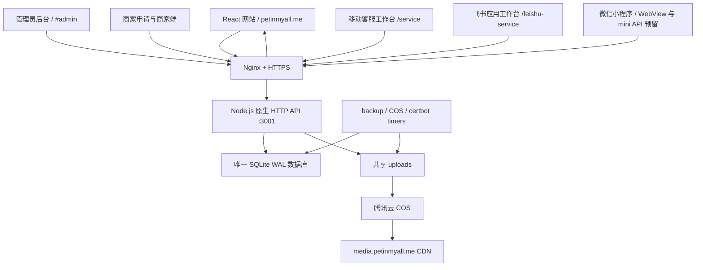
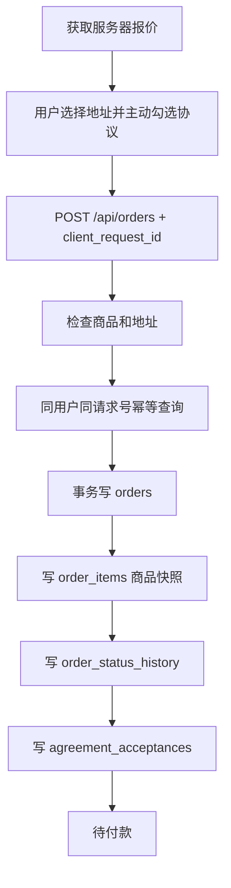

# 福宠 petinmyall.me 全量生产架构、数据库、数据流与开发续接手册

> 生成日期：2026-07-26
> 动态生产快照：2026-07-26 16:18（Asia/Shanghai）
> 项目性质：真实生产宠物商城、订单与客服系统，不是演示项目
> 适用范围：网站、管理后台、商家端、客服工作台、飞书工作台、微信小程序接口、腾讯云服务器、SQLite、COS/CDN
> 安全说明：本文只记录密钥变量名和保存位置，不包含私钥正文、App Secret、SecretKey、Token 或真实密码。

---

## 0. 下次接手先看这里

### 0.1 权威顺序

遇到旧聊天、旧手册和当前运行状态冲突时，按以下顺序判断：

1. 重新核验的线上生产状态。
2. 当前源码：`C:\Users\Administrator\Documents\Codex\2026-07-09\new-chat\workfuchong-web`。
3. 本文。
4. `outputs/petinmyall-production-runbook.md` 和 `outputs/deployment-progress.md`。
5. 更旧的聊天记录、截图和历史 release 名称。

生产计数、release、证书日期、磁盘空间和任务状态会变化，开始新任务时必须刷新。

### 0.2 绝对约束

- 不创建第二套生产数据库。
- 不把网站、小程序、商家端或客服端拆成互不相通的数据孤岛。
- 网站和小程序继续共享同一个 Node 服务、同一 SQLite 数据库和同一媒体资源。
- 不删除、重建或覆盖 `/srv/fuchong/shared`。
- 不用 `git reset --hard`、不覆盖用户未提交改动。
- 数据库变更只能通过向前兼容迁移完成，不删除旧字段和旧表。
- 修改订单、支付、库存、物流或客服时，必须同时做数据完整性与跨用户隔离测试。
- 飞书窄范围问题优先修网站/API，不要无故重建飞书应用、群组或权限。
- 生产发布必须先备份、构建、测试，再使用唯一 release 原子切换。
- 发布后必须核验公网资源，不能只以本地构建成功作为完成依据。

### 0.3 当前生产结论

| 项目 | 当前值 |
|---|---|
| 主站 | `https://petinmyall.me` |
| www | `https://www.petinmyall.me` |
| CDN | `https://media.petinmyall.me` |
| 客服移动工作台 | `https://petinmyall.me/service` |
| 飞书工作台 | `https://petinmyall.me/feishu-service` |
| 服务器 IPv4 | `43.166.1.45` |
| SSH 用户 | `ubuntu` |
| 腾讯云实例 | Lighthouse，首尔 |
| 当前 release | `/srv/fuchong/releases/20260726-checkout-benefits-v2` |
| 当前镜像 | `fuchong-api:20260726-checkout-benefits-v2` |
| API 容器 | `fuchong-api`，healthy，`unless-stopped` |
| API 内部端口 | `127.0.0.1:3001` |
| 数据库 | 单一 SQLite WAL |
| 数据库完整性 | `ok` |
| 外键异常 | `0` |
| 已应用迁移 | `44` |
| 业务表 | `60` |
| 法律协议版本 | `2026-07-26.2` |
| 客服只读语料 | `4998` 条、`478` 个意图、`6` 个业务组 |
| 固定宠物专属托运费 | 新报价和新订单 `¥350` |

---

## 1. 全局架构



### 1.1 技术栈

| 层 | 技术 |
|---|---|
| 网站前端 | React 19、TypeScript 6、Vite 8 |
| 样式 | 原生 CSS，移动端安全区与键盘适配 |
| API | Node.js 24，原生 HTTP 服务，主入口 `server/index.mjs` |
| 数据库 | SQLite，WAL，外键开启，迁移表记录版本 |
| 图片处理 | Sharp |
| 视频处理 | ffmpeg-static |
| 展示图处理 | ONNX Runtime + 图像流水线 |
| 消息推送 | Web Push / Service Worker |
| 部署 | Docker Compose、Nginx、immutable release、原子软链接 |
| 证书 | Let's Encrypt + certbot |
| 媒体 | 本地持久目录 → COS 增量同步 → CDN |
| 外部协作 | 飞书开放平台、多维表格、飞书内部客服工作台 |

### 1.2 当前不是生产权威的部分

- `worker/index.js` 保留历史 Cloudflare Worker/D1 兼容代码，但腾讯云生产权威是 `server/index.mjs`。
- 微信小程序原生页面曾开发过，但当前主体验以网站 WebView 为主；`/api/mini/v1/*` 是独立、可继续使用的预留接口层。
- 旧 release、旧计数和旧协议版本仅用于回滚或历史追踪。

---

## 2. 本地项目、关键路径与文件职责

### 2.1 本地路径

| 内容 | 路径 |
|---|---|
| 当前网站源码 | `C:\Users\Administrator\Documents\Codex\2026-07-09\new-chat\workfuchong-web` |
| 微信开发者工具项目 | `C:\Users\Administrator\WeChatProjects\miniprogram-1` |
| SSH 私钥位置 | `C:\Users\Administrator\Downloads\wqqdwd.pem` |
| 历史部署输出 | `C:\Users\Administrator\Documents\Codex\2026-07-19\chulaiyiegejaigou-1-3\outputs` |
| 本文 | `docs/petinmyall-production-full-handoff-2026-07-26.md` |

私钥路径可以记录，私钥正文禁止进入 Markdown、源码和 Git。

### 2.2 代码目录

| 路径 | 作用 |
|---|---|
| `src/App.tsx` | 主网站、用户端、商品详情、购买结算、用户中心入口 |
| `src/Admin.tsx` | 管理员后台 |
| `src/MerchantPortal.tsx` | 商家申请、登录、商品与订单操作 |
| `src/ServiceApp.tsx` | `/service` 移动客服工作台 |
| `src/FeishuServiceDesk.tsx` | `/feishu-service` 飞书应用工作台 |
| `src/legalDocuments.ts` | 用户、购买、售后、隐私、商家协议及版本 |
| `src/cartStore.ts` | 用户隔离的购物车本地缓存与服务端合并 |
| `src/visitor.ts` | 访客令牌与稳定游客身份 |
| `src/mediaUrl.ts` | 主域名、上传和 CDN 地址处理 |
| `server/index.mjs` | 生产 API、迁移、业务事务、管理接口 |
| `server/mini-api.mjs` | `/api/mini/v1/*` 小程序隔离接口 |
| `server/feishu-service.mjs` | 飞书/客服工作台鉴权、会话、接管与消息 |
| `server/customer-service-corpus.mjs` | 客服语义匹配器 |
| `server/customer-service-corpus.json` | 4998 条只读语料索引 |
| `server/customer-service-state.mjs` | 专员30秒自动恢复调度 |
| `server/service-push.mjs` | 客服工作台 Web Push |
| `server/pet-details.mjs` | 商品详情文字字段解析与默认补全 |
| `server/pet-identity.mjs` | 宠物身份证生成与稳定编号 |
| `server/migrations/*.sql` | 生产迁移 |
| `scripts/build-customer-service-corpus.py` | Excel 语料离线编译为 JSON |
| `deploy/tencent/publish.ps1` | Windows 发版入口 |
| `deploy/tencent/deploy-release.sh` | 服务器构建、切换、健康与回滚 |
| `deploy/tencent/compose.yaml` | API 容器 |
| `deploy/tencent/nginx-https.conf` | Nginx HTTPS 配置 |
| `deploy/tencent/cos-sync.py` | COS 增量同步 |
| `public/service-sw.js` | 客服 PWA Service Worker |
| `public/service.webmanifest` | 客服 PWA 清单 |

---

## 3. 生产服务器与网络

### 3.1 服务器资源

| 项目 | 2026-07-26 实测 |
|---|---|
| 系统 | Ubuntu 24.04.4 LTS |
| 内核 | `6.8.0-124-generic` |
| 主机名 | `VM-0-2-ubuntu` |
| CPU | 2 vCPU |
| 内存 | 3.6 GiB |
| 可用内存 | 约 2.8 GiB |
| Swap | 1.9 GiB |
| 根盘 | 59 GiB |
| 已用 | 50 GiB |
| 可用 | 7.1 GiB |
| 使用率 | 88% |
| 连续运行时间 | 约 6 天 18 小时 |

磁盘是当前最明显的运维风险。每次发布前必须执行：

```bash
df -h /
du -sh /srv/fuchong/releases /srv/fuchong/shared/backups /srv/fuchong/shared/uploads
```

只能在确认 `/srv/fuchong/current` 指向后，清理明确的旧 immutable release。禁止删除 `/srv/fuchong/shared`。

### 3.2 域名与路由

| 域名/路径 | 作用 |
|---|---|
| `petinmyall.me` | 主站、静态资源、API和上传入口 |
| `www.petinmyall.me` | 主站别名/重定向 |
| `media.petinmyall.me` | COS/CDN媒体 |
| `/api/*` | Nginx 反向代理至 `127.0.0.1:3001` |
| `/uploads/*` | API/共享上传访问 |
| `/service` | 客服移动 PWA |
| `/feishu-service` | 飞书内部工作台 |
| `/api/mini/v1/*` | 小程序隔离接口 |

Namecheap DNS：

- A：根域名 → `43.166.1.45`
- CNAME：www → 根域名
- CNAME：media → 腾讯云 CDN CNAME

### 3.3 HTTPS

| 项目 | 当前值 |
|---|---|
| CN | `petinmyall.me` |
| 签发方 | Let's Encrypt YE1 |
| 生效 | 2026-07-19 |
| 到期 | 2026-10-17 |
| 自动续期 | `certbot.timer` |

### 3.4 服务与自动任务

| 服务/任务 | 状态/周期 |
|---|---|
| nginx | active |
| docker | active |
| fail2ban | active |
| fuchong-api | healthy，unless-stopped |
| fuchong-cos-sync.timer | 每5分钟 |
| fuchong-backup.timer | 每日 |
| certbot.timer | 自动续期 |
| 最近COS同步 | success，退出码0 |
| 最近数据库备份 | success，退出码0 |

### 3.5 公网验收

以下地址在本次核验均返回 HTTP 200：

- `https://petinmyall.me/`
- `https://petinmyall.me/service`
- `https://petinmyall.me/feishu-service`
- `https://petinmyall.me/api/health`
- `https://petinmyall.me/api/mini/v1/health`
- `https://media.petinmyall.me/assets/shipment-inspection-20260726-v2.webp`

---

## 4. 服务器目录、部署、备份与回滚

### 4.1 服务器目录

```text
/srv/fuchong/
├─ current -> /srv/fuchong/releases/<release>
├─ releases/
│  └─ <每次不可变发布版本>
└─ shared/
   ├─ .env.production
   ├─ data/fuchong.db
   ├─ uploads/
   ├─ backups/
   └─ scripts/
```

release 中只有代码和构建产物。数据库、上传、备份和密钥均在 shared，因此代码更新不会覆盖业务数据。

### 4.2 标准发布

```powershell
cd C:\Users\Administrator\Documents\Codex\2026-07-09\new-chat\workfuchong-web

npm run lint
npm test
npm run build

powershell.exe -NoProfile -ExecutionPolicy Bypass `
  -File .\deploy\tencent\publish.ps1 `
  -IdentityFile C:\Users\Administrator\Downloads\wqqdwd.pem `
  -ReleaseTag <唯一版本名>
```

发布脚本执行：

1. 排除 `.git`、依赖、缓存、日志、环境文件和本地数据库。
2. 打包并上传服务器。
3. 创建新的 `/srv/fuchong/releases/<release>`。
4. 启动备份服务。
5. 服务器执行 `npm ci` 和生产构建。
6. 构建唯一标签的 API 镜像。
7. 原子切换 `/srv/fuchong/current`。
8. 重建容器。
9. 等待健康检查。
10. 检查 Nginx。
11. 触发 COS 同步。
12. 失败时自动切回上一 release。

### 4.3 手工回滚

```bash
sudo ln -sfn /srv/fuchong/releases/<旧版本> /srv/fuchong/current
cd /srv/fuchong/current
RELEASE_TAG=<旧版本> sudo -E docker compose -f deploy/tencent/compose.yaml up -d
sudo nginx -t
sudo systemctl reload nginx
curl -fsS https://petinmyall.me/api/health
```

数据库迁移是向前兼容的。代码回滚通常保留新字段和新表，让旧代码忽略它们；禁止用破坏性数据库回滚。

### 4.4 备份

当前重要备份包括：

- `pre-checkout-benefits-20260726T0810Z.db`
- `pre-transport-fee-350-20260726T0752Z.db`
- `pre-legal-20260726-v2-20260726T073653Z.db`
- `pre-user-inspection-20260726T065325Z.db`
- `pre-admin-confirm-chip-20260726T063258Z.db`
- `pre-pet-profile-20260726T054410Z.db`
- `pre-identity-20260726T042430Z.db`

推荐使用 SQLite backup API 或项目备份服务，不要在写入中直接复制主 `.db` 而忽略 WAL。

恢复前必须：

1. 停止 API 写入。
2. 保存故障库副本。
3. 对备份执行 `PRAGMA integrity_check`。
4. 对备份执行 `PRAGMA foreign_key_check`。
5. 用独立路径打开并核对核心计数。
6. 再替换生产库。

---

## 5. 密钥、密码和环境变量

### 5.1 唯一生产密钥位置

`/srv/fuchong/shared/.env.production`

- 归属：服务器端。
- 权限目标：`600`。
- 不进入 release。
- 不进入 Git。
- 不返回给前端。

### 5.2 当前环境变量名

| 类别 | 变量 |
|---|---|
| 管理员 | `ADMIN_INITIAL_PASSWORD`、`ADMIN_TOKEN_SECRET` |
| 飞书同步 | `FEISHU_APP_ID`、`FEISHU_APP_SECRET` |
| 飞书客服 | `FEISHU_SERVICE_APP_ID`、`FEISHU_SERVICE_APP_SECRET`、`FEISHU_SERVICE_VERIFICATION_TOKEN`、`FEISHU_SERVICE_AGENT_TOKEN_SECRET`、`FEISHU_SERVICE_API_BASE` |
| 小程序 | `WECHAT_MINI_APP_ID`、`WECHAT_MINI_APP_SECRET`、`MINI_API_ENABLED`、`MINI_TOKEN_SECRET` |
| COS/CDN | `TENCENT_SECRET_ID`、`TENCENT_SECRET_KEY`、`TENCENT_COS_BUCKET`、`TENCENT_COS_REGION`、`MEDIA_CDN_BASE` |
| Web Push | `WEB_PUSH_PUBLIC_KEY`、`WEB_PUSH_PRIVATE_KEY`、`WEB_PUSH_SUBJECT` |

生产环境当前没有看到 `WECHAT_PAY_*` 变量，因此真实微信支付参数不能视为已完成。当前用户付款体验是二维码付款声明 + 管理员核实到账。

### 5.3 必须轮换的凭据

聊天历史中曾出现：

- 腾讯云长期 SecretId/SecretKey。
- 飞书 App Secret。
- 微信小程序 AppSecret。
- SSH 私钥路径。

长期凭据应在腾讯云 CAM、飞书开放平台和微信公众平台轮换，然后同步更新 `.env.production`。轮换后重启 API并验证，不要把新值写进本文。

---

## 6. 前端页面与用户体验

### 6.1 页面入口

| 页面 | 入口 | 数据来源 |
|---|---|---|
| 首页 | `/` | pets、categories、banners、home_content_blocks |
| 商品列表/搜索 | 主站导航 | `/api/pets` |
| 商品详情 | 主站商品卡 | `/api/pets/:id` |
| 收藏/关注/足迹 | 用户中心 | favorites、follows、footprints |
| 购物车 | 用户中心/底栏 | cart_items |
| 地址 | 用户中心 | addresses |
| 优惠券 | 用户中心 | coupons、user_coupons |
| 我的订单 | 用户中心 | orders、order_items、payments、logistics |
| 客服聊天 | 商品详情/底部客服 | customer_service_sessions、messages |
| 协议页面 | 用户中心/结算 | `src/legalDocuments.ts` |
| 管理员后台 | `/#admin` | `/api/admin/*` |
| 商家申请/商家端 | 网站商家入口 | `/api/merchant/*` |
| 客服工作台 | `/service` | `/api/feishu-service/*` |
| 飞书工作台 | `/feishu-service` | `/api/feishu-service/*` |

### 6.2 移动端关键规则

- 输入框至少16px，避免 iPhone 键盘触发页面缩放。
- 使用动态视口和内部滚动，键盘弹出时只调整聊天框，不放大整页。
- 客服弹窗背景点击不关闭，避免键盘收起后的点击穿透。
- 只能由明确的关闭按钮关闭聊天。
- 发送按钮和表单阻止事件冒泡。
- 底部导航必须明显并适配安全区。
- 商品大图和身份证使用 WebP、懒加载、异步解码。

### 6.3 商品详情

当前详情包含：

- 图片/视频轮播。
- 商品价格、品种、性别称呼、年龄、毛色、体型、毛发长度。
- 性格能量与健康等级。
- 生命周期与24小时保险倒计时。
- 防疫档案与RFID皮下微型芯片礼遇。
- 发货前宠物实拍检验说明。
- 宠物身份证。
- 商家资料、评价、客服与立即购买。

商品详情资料来源顺序：

1. 结构化商品字段。
2. 飞书/商家文字详情解析。
3. 服务器明确默认值或稳定生成值。
4. 前端仅作为短期兼容回退，不覆盖服务器档案。

---

## 7. 用户、游客、登录与数据归属

### 7.1 身份模型

```text
visitor token
  → visitors
  → stable guest users.id
  → phone/account/wechat login
  → user_auth
  → optional guest-to-formal merge
```

`users.id` 是网站业务的核心归属键。收藏、购物车、地址、订单、消息、会话都必须绑定该 ID。

### 7.2 登录规则

- 手机号、账号、openid、wechat_openid 用于找到已有用户。
- 已有身份再次登录必须返回同一个用户，不创建重复正式账号。
- 游客合并只允许把明确的 guest 账号合并到正式账号。
- 不能让客户端任意传入 `user_id` 读取其他用户私有数据。
- 小程序私有接口以 Bearer Token 为权威，不信任客户端伪造用户ID。

### 7.3 用户隔离

以下记录必须按 `user_id` 校验：

- 收藏、关注、足迹、购物车。
- 地址、优惠券。
- 订单、订单详情、物流媒体。
- 客服会话、消息、未读。
- 小程序上传。

同一个用户在商品详情、六类咨询、主客服入口和小程序入口复用同一个最新主会话；历史重复会话保留，但后台只显示主会话，不能把不同用户合并。

---

## 8. 商品、库存与飞书同步数据处理流

### 8.1 商品写入来源

商品可来自：

- 管理员后台。
- 飞书多维表格同步。
- 商家端。

三条入口最终写入同一套表：

```text
pets
├─ pet_products
├─ pet_skus
├─ inventory
├─ pet_images
├─ pet_videos
├─ pet_identity_profiles
├─ breeds
└─ sellers
```

### 8.2 飞书同步标准流程


稳定性机制：

- 飞书 `record_id` 映射 `pets.external_id`，重复同步更新原商品。
- 预览存在 `feishu_sync_previews`，确认前不写业务商品。
- 每行原始数据存在 `feishu_sync_task_items`。
- `processed/success/failed` 持久化，重启后继续。
- 支持暂停、继续、重试和错误明细。
- 图片处理并发为1，避免内存和CPU挤压。
- 单行失败只回滚单行保存点，不影响同批其他商品。
- 空字段不得覆盖已有正确字段。
- 最多支持500条一个配置批次，读取和处理采用分批方式。

### 8.3 商品资料解析

字段优先级：

```text
结构化字段
→ 文字详情解析
→ 明确默认
→ 稳定生成值
```

当前规则：

- 缺失体型：默认中型。
- 缺失健康状态：默认健康/待商家补充明细。
- 性别：优先结构化字段，再解析详情。
- 毛色、毛长、出生日期：优先真实字段或详情。
- 性格能量：缺失时由统一规则稳定生成一次并写档案，不在每次打开页面时重新随机。

### 8.4 宠物身份证

`pet_identity_profiles` 与商品一对一。

保存：

- 待宠物主起名。
- 品种、性别、出生日期、毛色。
- 体型、毛长、性格、健康、免疫。
- 平台身份证号。
- 平台芯片展示号。
- 签发日期、算法版本、来源记录。

稳定规则：

- 身份证号、芯片展示号和签发日期首次生成后保持不变。
- 后续同步只更新允许变化的真实资料。
- 编号是平台展示编号，不等同于实际植入芯片证明。
- 实物RFID芯片以交付检验和实物记录为准。
- 新订单把完整商品详情和身份证档案写入 `order_items.pet_snapshot`。
- 商品后来修改，不覆盖历史订单快照。

---

## 9. 媒体、上传、COS与CDN

### 9.1 通用流程

```text
客户端上传
→ 服务端校验权限、大小、扩展名、MIME和文件头
→ /srv/fuchong/shared/uploads
→ 主域名立即可访问
→ COS定时增量同步
→ media.petinmyall.me CDN
```

COS SecretKey 永远只在服务器端，不能放到网站或小程序。

### 9.2 商品媒体

- `pet_images` 保存原图、缩略图、WebP、尺寸和排序。
- `pet_videos` 保存视频、封面、时长、转码状态。
- 列表用缩略图，详情按需加载高清。
- 飞书附件由服务器授权代理读取，前端不持有飞书令牌。

### 9.3 物流25%实拍

管理员在物流25%节点可补充：

- 最多6张图片。
- 最多1段60秒内视频。
- 图片最大10MB。
- 视频最大30MB。

处理：

- 图片最长边1600px WebP。
- 生成480px缩略图。
- 视频转720p H.264/AAC。
- 生成封面，支持快速起播。
- 处理队列并发1。

数据保存到 `logistics_event_media`。只有订单所属用户与管理员可读取关联信息。用户“我的订单”列表和详情均能查看25%节点照片/视频。

---

## 10. 购物车、报价、订单、支付、库存与物流

### 10.1 购物车

- 游客购物车按游客用户ID保存。
- 正式登录后通过 `/api/cart/merge` 幂等合并。
- 服务端数据库是真值，本地缓存按用户隔离。
- 不能在用户切换后继续展示上一用户本地购物车。

### 10.2 新订单报价

当前报价公式：

```text
pet_amount = 当前宠物价格
shipping_fee = 350
total_amount = pet_amount + shipping_fee
```

结算框显示：

- 宠物专属托运 ¥350。
- 总计付款。
- 已减 ¥300 平台补贴。
- 赠送动物芯片 RFID 动物皮下微型芯片。
- `guarantee_eligible=true` 才显示平台退换保障。
- `insurance_offer.eligible_now=true` 才显示赠送宠物保险。
- 品质与商家问责：品种纯正、图片一致、健康筛选、繁育咨询、商家问责等，以订单资料、检验记录和实际履约情况为准。

注意：当前 API `discount_amount=0`，网站把数据库内当前宠物价格解释为已经享受平台补贴后的展示价格，不会在付款时再次减300元。未来如果要改成真实算术优惠，必须同时调整 `list_price`、`discount_amount`、订单实付、管理后台和测试，不能只改文字。

### 10.3 协议确认

创建订单前用户必须主动勾选：

- 用户协议。
- 购买协议。
- 交易规则。
- 售后规则。
- 隐私政策。

服务端校验：

- `accepted=true`。
- 文档集合完整。
- 版本为 `2026-07-26.2`。

接受记录写入 `agreement_acceptances`，历史订单保留当时版本。

### 10.4 订单创建



当前待付款订单不锁库存，其他用户仍可下单。真正核实到账时才在一个事务内锁库存并下架商品。

### 10.5 当前付款方式

当前真实用户流程：

1. 创建待付款订单。
2. 显示上方微信收款码。
3. 显示下方福宠官方客服二维码。
4. 用户点击“我已支付”后，订单进入待确认，但 `payment_status` 仍是 unpaid。
5. 管理员核实真实到账。
6. 管理员一键确认订单。

真实微信JSAPI支付代码存在，但生产环境没有完整 `WECHAT_PAY_*` 参数，不能视为已启用。

### 10.6 管理员一键确认

标准接口：

`POST /api/admin/orders/:id/confirm`

对待付款或待确认订单，一个原子事务完成：

1. 写唯一管理员手工支付流水。
2. 锁定订单库存。
3. 标记商品 sold 并下架。
4. 核定24小时宠物保险资格。
5. 更新订单为 `pending_ship`。
6. 写订单状态历史。

重复调用必须返回幂等结果，不能重复入账、重复锁库存或重复下架。

### 10.7 24小时宠物保险

- 窗口按商品 `created_at` 连续24小时计算。
- 下单保存不可变截止时间。
- 最终资格以管理员确认到账的服务器时间判断。
- 资格确认与支付、库存锁定、商品下架在同一事务。
- 与其他售后保障相互独立。

### 10.8 物流

`logistics` 保存当前状态；`logistics_events` 保存进度历史；`logistics_event_media` 保存25%实拍。

用户端和管理员端读取同一组表，不允许维护两套物流状态。

---

## 11. 管理员后台

### 11.1 主要模块

- 管理员登录与修改密码。
- 统计概览。
- 数据库状态、迁移、完整性。
- 商品新增、修改、批量状态。
- 图片、视频、SKU、库存。
- 用户管理。
- 订单、费用、商品快照。
- 一键确认付款与待发货。
- 物流更新与25%实拍上传。
- 支付流水。
- 售后、投诉、商家举报。
- 商家入驻审核和账号。
- 社区申请。
- Banner、分类、优惠券。
- 评价。
- 飞书配置、预览、任务、暂停、继续、重试。
- 客服会话。
- API错误与管理员操作日志。

### 11.2 订单后台

订单列表直接显示：

- 宠物原价。
- 补贴。
- 托运费。
- 实付。
- 下单时商品详情摘要。
- 商品不可变快照。

管理员不必先打开详情才能看到费用与原始介绍；完整详情仍保留全部订单项、物流、媒体和状态历史。

### 11.3 权限

- 管理接口使用 Bearer Token。
- 管理员密码只保存 hash + salt。
- 管理操作写 `admin_operation_logs`。
- 登录和敏感接口有速率限制。
- 不把管理员令牌写入URL或公开日志。

---

## 12. 商家端

### 12.1 入驻流程

```text
商家填写申请
→ 主动同意商家协议与隐私政策
→ merchant_applications
→ 管理员审核
→ merchant_accounts
→ 商家登录
```

### 12.2 商家能力

- 查看与修改自身资料。
- 上传媒体。
- 新增或管理归属自身的商品。
- 查看自身相关订单。
- 更新授权订单物流。

权限必须校验 `merchant_account_id` 或商品归属，不能通过传入其他商品ID越权。

---

## 13. 客服系统

### 13.1 六个业务组

| group_key | 用户含义 |
|---|---|
| `purchase` | 购买咨询 |
| `order` | 订单咨询 |
| `after_sale` | 售后服务 |
| `pet_health` | 宠物健康咨询 |
| `logistics` | 物流帮助 |
| `official` | 官方客服 |

### 13.2 用户侧原则

- 用户只在网站客服窗口沟通。
- 用户侧显示“在线客服”，不显示AI技术标识。
- 回复前显示“客服正在回复…”。
- 自动回复有1–2秒真人化延迟。
- 商品卡片进入会话后固定短回复“在的”，用户下一条文字再匹配语料。
- 同一用户只有一个主聊天框和一份连续历史。
- 不同用户的会话和消息不能混淆。

### 13.3 只读语料库

当前索引：

| 项目 | 值 |
|---|---|
| 版本 | `2026-07-22.2` |
| 条目 | 4998 |
| 意图 | 478 |
| 业务组 | 6 |
| 源文件 | 两份2500条Excel合并 |
| 运行方式 | 只读JSON，不写生产知识表 |

数据库中的 `customer_service_knowledge` 仍有818条，但自动在线接待权威是新的只读 JSON 语料索引。

更新语料：

1. 保存新版 Excel。
2. 运行 `scripts/build-customer-service-corpus.py`。
3. 校验条目、意图、业务组、空值、重复和SHA-256。
4. 运行客服测试。
5. 发布代码。

不需要迁移生产数据库。

### 13.4 匹配算法

处理顺序：

1. 中文口语标准化。
2. 去除无意义标点、空格和修饰词。
3. 同义表达归一。
4. 完整问题匹配。
5. 精确关键词候选。
6. 当前咨询组加权。
7. 子句相似度、整句相似度和特异性排序。
8. 低置信度返回自然澄清。

不再使用简单数组首次 `includes` 直接决定答案。托运、生病、加急、退款、地区等重复词要经过候选排序，避免串意图。

### 13.5 人工接管

默认状态是自动在线接待。只有用户点击小型入口“转接为福宠用户宠物专员”才进入：

```text
ai
→ human_pending
→ human
→ ai
```

规则：

- 普通退款、投诉、健康或低置信度问题不会自动转人工。
- 用户主动转接才写 `human_pending` 并通知飞书。
- 人工接管或回复重置30秒期限。
- 30秒无人工活动自动恢复 `ai`。
- 用户消息不会无限延长人工期限。
- 恢复后仍在同一个会话中回复未处理的最后消息。
- 后台可以手动切回在线客服。
- 人工稍后再次回复可重新接管同一会话，不创建第二个聊天框。

### 13.6 `/service` 移动工作台

- 按六组显示队列。
- 显示未读角标。
- 队列约1.5秒轮询。
- 当前会话约1.2秒轮询。
- 支持查看历史、回复、结束服务和切回自动接待。
- PWA可添加手机桌面。
- Web Push需要安装PWA并授权通知。
- 当前 `service_agent_push_subscriptions` 为0，说明尚无有效订阅记录；推送功能代码与VAPID变量存在，但实际手机需重新订阅验证。

### 13.7 飞书工作台

- 飞书是内部客服入口，不把用户跳转到飞书。
- 使用飞书OAuth或管理员换取客服工作台令牌。
- 飞书回复写入同一 `messages` 表。
- 网站轮询同一会话后显示人工回复。
- 飞书事件通过 `/api/integrations/feishu/events` 接收并用 `feishu_event_receipts` 幂等去重。

---

## 14. 微信小程序

### 14.1 当前项目

| 项目 | 值 |
|---|---|
| 本地目录 | `C:\Users\Administrator\WeChatProjects\miniprogram-1` |
| AppID | `wxc3e62dde05141614` |
| 当前主要体验 | WebView打开主站 |
| request域名 | `https://petinmyall.me` |
| uploadFile域名 | `https://petinmyall.me` |
| downloadFile域名 | 主站与CDN |

### 14.2 mini API

前缀：`/api/mini/v1`

主要接口：

- 健康、bootstrap。
- 微信code登录、刷新、退出。
- 分类、商品列表、商品详情。
- 我的资料。
- 收藏、足迹、购物车。
- 地址。
- 报价、订单创建、订单列表、订单详情。
- 客服会话和消息。
- 图片上传与CDN状态。

安全：

- AppSecret只在服务器。
- access token短期有效。
- refresh token只存hash。
- 私有接口只信任Bearer Token。
- 不自动把微信用户合并到手机号网站账号。

当前生产 `mini_user_sessions=0`、`media_uploads=0`，说明本次快照时没有活跃mini token会话或mini上传数据。

---

## 15. 法律协议与接受记录

当前版本：`2026-07-26.2`

文档包括：

- 用户协议。
- 购买协议。
- 交易规则。
- 售后与退款规则。
- 隐私政策。
- 商家入驻与合作协议。

原则：

- 结算页只保留紧凑主动勾选，不展开全文。
- 全文在独立协议页面。
- 服务端校验版本和文档集合。
- 重大条款不能使用默认同意。
- 历史接受记录不因协议升级被覆盖。
- 一般营销素材可说明为广告/要约邀请，但具体照片、订单快照、付款页、发货实拍和明确承诺是否成为合同内容，应结合交易记录和法律判断。
- 开箱视频是首要核心证据，但不能用格式条款绝对排除所有其他合法证据。

---

## 16. API 接口总览

### 16.1 公共与用户接口

| 领域 | 主要路径 |
|---|---|
| 健康 | `GET /api/health` |
| 游客 | `POST /api/visitors/session` |
| 登录 | `POST /api/users/login` |
| 用户 | `/api/users/:id`、绑定手机、认证、summary |
| 商品 | `/api/pets`、`/api/pets/:id`、分类、品种计数 |
| 商家公开页 | `/api/sellers/:id`、举报 |
| 评价 | 评价列表、like |
| 收藏 | `/api/favorites` |
| 关注 | `/api/follows` |
| 足迹 | `/api/footprints` |
| 购物车 | `/api/cart`、`/api/cart/merge` |
| 地址 | `/api/addresses` |
| 优惠券 | `/api/coupons` |
| 报价 | `GET /api/orders/quote` |
| 订单 | `POST/GET /api/orders`、详情、取消、付款声明 |
| 支付 | mock、微信prepay、微信notify |
| 售后 | `POST /api/after-sales` |
| 投诉 | `POST /api/complaints` |
| 消息 | `GET/POST /api/messages` |
| 客服 | `/api/customer-service/session*`、read、handoff |
| 飞书媒体 | `/api/media/feishu` |
| 展示图 | `/api/media/product-showcase/:id` |

### 16.2 管理接口

前缀 `/api/admin`，需要管理员 Bearer Token。

接口域：

- login、change-password。
- db/status、stats、logs。
- pets、bulk-status、inventory、skus、images、videos、uploads。
- users。
- orders、payment、confirm、logistics、logistics-event media。
- payments。
- merchant-applications、merchant-accounts。
- community-applications。
- complaints、after-sales、seller-reports。
- banners、categories、coupons、reviews。
- feishu configs、test、preview、commit、sync、tasks、pause、resume、retry、errors。
- customer-service sessions。
- home-content。

### 16.3 商家接口

前缀 `/api/merchant`：

- applications。
- login。
- me。
- catalog。
- uploads。
- products。
- product images/videos。
- orders。
- logistics。

### 16.4 客服工作台接口

前缀 `/api/feishu-service`：

- config。
- auth。
- admin-auth。
- groups。
- groups/bootstrap。
- sessions。
- session messages。
- takeover。
- close。

PWA推送：

- `/api/service-app/config`
- `/api/service-app/push/subscribe`
- `/api/service-app/push/test`

### 16.5 小程序接口

前缀 `/api/mini/v1`，详见第14节。

---

## 17. 数据库总览

### 17.1 当前状态

| 项目 | 当前值 |
|---|---|
| 数据库文件 | `/srv/fuchong/shared/data/fuchong.db` |
| journal mode | WAL |
| 表数量 | 60 |
| 迁移数量 | 44 |
| integrity_check | ok |
| foreign_key_check | 0 |

### 17.2 生产实时计数

以下是 2026-07-26 16:18 快照，不是固定业务承诺：

| 表 | 行数 | 作用 |
|---|---:|---|
| users | 530 | 正式用户与游客用户主体 |
| visitors | 508 | 访客令牌与访问次数 |
| user_auth | 39 | 多身份认证映射 |
| user_login_logs | 35 | 登录审计 |
| addresses | 13 | 收货地址 |
| favorites | 21 | 收藏 |
| follows | 3 | 商家关注 |
| footprints | 545 | 浏览足迹 |
| cart_items | 3 | 购物车 |
| coupons | 1 | 优惠券模板 |
| user_coupons | 21 | 用户优惠券 |
| categories | 181 | 分类 |
| breeds | 11 | 品种档案 |
| pets | 201 | 商品/宠物核心资料 |
| pet_products | 201 | 商品状态与来源关联 |
| pet_skus | 176 | SKU |
| inventory | 204 | 库存 |
| inventory_deduplicate_logs | 19748 | 历史库存去重审计 |
| pet_images | 196 | 商品图片 |
| pet_videos | 21 | 商品视频 |
| pet_identity_profiles | 201 | 宠物身份证档案 |
| sellers | 20 | 商家公开档案 |
| seller_reviews | 2560 | 商家评价 |
| seller_reports | 0 | 商家举报 |
| product_reviews | 84 | 商品评价 |
| orders | 42 | 订单 |
| order_items | 42 | 订单商品快照 |
| order_status_history | 65 | 状态历史 |
| payments | 5 | 支付流水 |
| logistics | 7 | 当前物流 |
| logistics_events | 8 | 物流进度历史 |
| logistics_event_media | 2 | 25%实拍媒体 |
| after_sales | 0 | 售后申请 |
| complaints | 0 | 投诉 |
| daily_order_sequences | 8 | 每日订单序列 |
| agreement_acceptances | 130 | 协议接受记录 |
| messages | 286 | 客服消息 |
| customer_service_sessions | 49 | 客服会话 |
| customer_service_groups | 6 | 客服业务组 |
| customer_service_events | 35 | 客服事件 |
| customer_service_knowledge | 818 | 历史数据库知识 |
| service_agent_push_subscriptions | 0 | 客服Web Push订阅 |
| feishu_event_receipts | 3 | 飞书事件幂等 |
| feishu_sync_configs | 1 | 飞书同步配置 |
| feishu_sync_previews | 14 | 同步预览 |
| feishu_sync_tasks | 11 | 同步任务 |
| feishu_sync_task_items | 113 | 逐行任务 |
| sync_task_errors | 40 | 同步错误 |
| merchant_applications | 4 | 商家申请 |
| merchant_accounts | 1 | 商家账号 |
| community_applications | 2 | 社区申请 |
| banners | 2 | Banner |
| home_content_blocks | 2 | 小程序/动态首页块 |
| mini_user_sessions | 0 | 小程序会话 |
| media_uploads | 0 | 小程序上传 |
| admins | 1 | 管理员 |
| admin_operation_logs | 142 | 管理操作审计 |
| api_error_logs | 46 | API错误 |
| api_rate_limits | 0 | 持久速率限制桶 |
| schema_migrations | 44 | 迁移记录 |

### 17.3 核心关系

```text
users
├─ visitors / user_auth / user_login_logs
├─ addresses / favorites / follows / footprints / cart_items
├─ user_coupons
├─ orders
│  ├─ order_items ─ pets
│  ├─ payments
│  ├─ logistics ─ logistics_events ─ logistics_event_media
│  ├─ order_status_history
│  ├─ after_sales / complaints
│  └─ agreement_acceptances
└─ customer_service_sessions
   ├─ messages
   └─ customer_service_events

pets
├─ pet_products
├─ pet_skus
├─ inventory
├─ pet_images
├─ pet_videos
├─ pet_identity_profiles
├─ product_reviews
├─ breeds
└─ sellers
```

### 17.4 迁移清单

1. `001_commerce_stabilization.sql`
2. `002_inventory_deduplicate.sql`
3. `003_sanitize_mojibake_demo_text.sql`
4. `004_customer_login_frontend_stability.sql`
5. `005_sanitize_p0_test_text.sql`
6. `006_sanitize_utf8_cli_test_text.sql`
7. `007_user_auth_breed_service_favorite_integrity.sql`
8. `008_operational_integrity.sql`
9. `009_pet_browsing_indexes.sql`
10. `010_category_seed_deduplicate.sql`
11. `011_sync_preview_reviews_order_history.sql`
12. `012_disable_empty_feishu_configs.sql`
13. `013_disable_placeholder_feishu_configs.sql`
14. `014_order_sequence_and_breed_origins.sql`
15. `015_review_generation.sql`
16. `016_review_limit.sql`
17. `017_breed_origin_story.sql`
18. `018_seller_profiles.sql`
19. `019_seller_reviews_reports.sql`
20. `020_product_identity_and_review_coverage.sql`
21. `021_user_data_sync_order_integrity.sql`
22. `022_seller_media_review_depth.sql`
23. `023_scale_and_transaction_indexes.sql`
24. `024_multi_user_data_ownership.sql`
25. `025_order_confirmation.sql`
26. `026_product_business_id.sql`
27. `027_newcomer_subsidy_and_guarantee.sql`
28. `028_community_applications.sql`
29. `029_product_visibility_and_order_payment.sql`
30. `030_feishu_showcase_processing_progress.sql`
31. `031_merchant_onboarding_portal.sql`
32. `027_intelligent_customer_service.sql`
33. `032_feishu_customer_service_delivery.sql`
34. `033_customer_service_knowledge_expansion.sql`
35. `034_customer_service_knowledge_800.sql`
36. `036_legal_agreement_acceptances.sql`
37. `037_wechat_mini_program.sql`
38. `038_service_push_subscriptions.sql`
39. `039_payment_time_inventory_lock.sql`
40. `040_customer_service_auto_resume.sql`
41. `041_logistics_event_media.sql`
42. `042_order_24h_pet_insurance.sql`
43. `043_pet_identity_pipeline.sql`
44. `044_pet_profile_source_and_order_snapshot.sql`

注意历史上存在两个逻辑“027”文件，但 `schema_migrations.id` 已明确记录执行顺序；不要重命名已应用迁移。

---

## 18. 数据完整性与审计

必须长期保持：

- `PRAGMA integrity_check = ok`
- `PRAGMA foreign_key_check` 返回0行。
- 订单金额满足：订单项总价 + shipping_fee = total_amount。
- 库存不能为负。
- `available_stock + locked_stock <= total_stock`。
- 支付流水对订单唯一。
- `client_request_id` 对同用户幂等。
- 订单状态变化有历史。
- 飞书已完成任务的 processed/success/failed 对齐。
- 身份证号和芯片展示号唯一。
- 客服消息属于同用户会话。
- 物流媒体属于正确订单和事件。

诊断来源：

| 问题 | 数据 |
|---|---|
| API异常 | `api_error_logs.request_id` |
| 管理操作 | `admin_operation_logs` |
| 飞书逐行失败 | `feishu_sync_task_items`、`sync_task_errors` |
| 订单变化 | `order_status_history` |
| 客服接管 | `customer_service_events` |
| 飞书事件重复 | `feishu_event_receipts` |

---

## 19. 测试与发布验收

### 19.1 本地

```powershell
$env:Path = "C:\Program Files\nodejs;" + $env:Path
Remove-Item Env:ALL_PROXY,Env:HTTP_PROXY,Env:HTTPS_PROXY -ErrorAction SilentlyContinue
npm run lint
npm test
npm run build
```

当前自动测试共11项，覆盖：

- 用户、商品、订单、支付、物流。
- 新网站客服、飞书机器人和人工工作台。
- 商家、同库商品、媒体和权限。
- mini API token隔离。
- 商品详情解析。
- 结构化字段优先级。
- 日期解析。
- 宠物身份证稳定编号。
- 缺失默认值。
- 性格稳定生成。
- 身份证采用解析资料。

### 19.2 生产

```bash
readlink -f /srv/fuchong/current
sudo docker ps --filter name=fuchong-api
curl -fsS https://petinmyall.me/api/health
sudo nginx -t
systemctl list-timers --all | grep -E 'fuchong|certbot'
df -h /
```

数据库：

```sql
PRAGMA integrity_check;
PRAGMA foreign_key_check;
PRAGMA journal_mode;
```

页面：

- 主站首页。
- 商品详情。
- 购买结算与实际报价。
- 我的订单。
- 管理后台。
- `/service`。
- `/feishu-service`。
- mini health。
- CDN真实对象。

---

## 20. 当前风险与后续优先级

### P0：磁盘

根盘使用率88%，仅约7.1GB可用。下一次大型发布、模型资源或媒体处理前先清理旧 release 或扩大磁盘。

### P0：凭据轮换

腾讯云、飞书和微信长期密钥曾在聊天出现，必须轮换。Git提交前持续做秘密扫描。

### P1：真实支付

当前是二维码 + 用户声明 + 管理员核实到账。真实微信支付需要完整商户号、APIv3密钥、证书、回调和审核，不能把现状描述为自动微信支付。

### P1：补贴语义

当前页面显示“已减 ¥300 平台补贴”，但服务端 `discount_amount=0`，数据库商品价格被当作补贴后价格。若以后需要可审计的真实补贴，必须改为明确原价、优惠和成交价。

### P1：客服推送

Web Push服务已部署，但订阅表为0。需要在真实手机把 `/service` 添加桌面、授权通知并测试后台消息推送。

### P1：小程序形态

当前主体验仍是WebView；原生mini API存在但会话计数为0。若恢复原生小程序，必须继续共享现有后端，不建立第二套数据。

### P2：监控

建议增加：

- API 5xx率。
- 支付确认失败。
- 订单金额审计。
- 库存异常。
- 飞书同步失败。
- 客服队列和推送失败。
- COS同步失败。
- 磁盘>85%告警。

---

## 21. 下次更新标准步骤

1. 阅读本文。
2. 检查当前源码路径和 `git status`。
3. 拉取远程前先确认本地是否有未提交改动。
4. 实时核验 release、容器、API、磁盘、数据库完整性和计数。
5. 明确本次只影响哪些表、接口和页面。
6. 优先做最小增量修改。
7. 不重构无关数据流。
8. 运行lint、11项测试和生产构建。
9. 运行秘密扫描。
10. 使用SQLite backup API创建独立备份并验证。
11. 使用唯一 release 发布。
12. 验证受影响流程和未受影响基线。
13. 更新本文的动态快照、release和风险。
14. 用户明确授权后再commit/push。

---

## 22. 快速命令

### 22.1 SSH

```powershell
ssh -i C:\Users\Administrator\Downloads\wqqdwd.pem ubuntu@43.166.1.45
```

### 22.2 健康

```powershell
curl.exe --noproxy "*" -fsS https://petinmyall.me/api/health
curl.exe --noproxy "*" -I https://petinmyall.me/service
curl.exe --noproxy "*" -I https://petinmyall.me/feishu-service
```

### 22.3 发布

```powershell
powershell.exe -NoProfile -ExecutionPolicy Bypass `
  -File .\deploy\tencent\publish.ps1 `
  -IdentityFile C:\Users\Administrator\Downloads\wqqdwd.pem `
  -ReleaseTag yyyyMMdd-feature-v1
```

### 22.4 Git

```powershell
git status --short
git diff --check
git diff --stat
git log -5 --oneline
```

提交前必须确认 `.env`、数据库、私钥、备份、日志、Token和Secret不在暂存区。

---

## 23. 本次Git快照

- 基线提交前HEAD：`c4ac8f2`
- 分支：`main`
- 远程：`origin/main`
- 本轮包含：2026-07-19至2026-07-26累计的生产源码、迁移、部署配置、客服语料、媒体、协议、结算和本文。
- 全量源码快照提交：`a847604`（`feat: snapshot production commerce and service platform`）。
- 本文记录更新将作为紧随其后的文档提交；远程最终状态以 `git log -2 --oneline` 为准。
