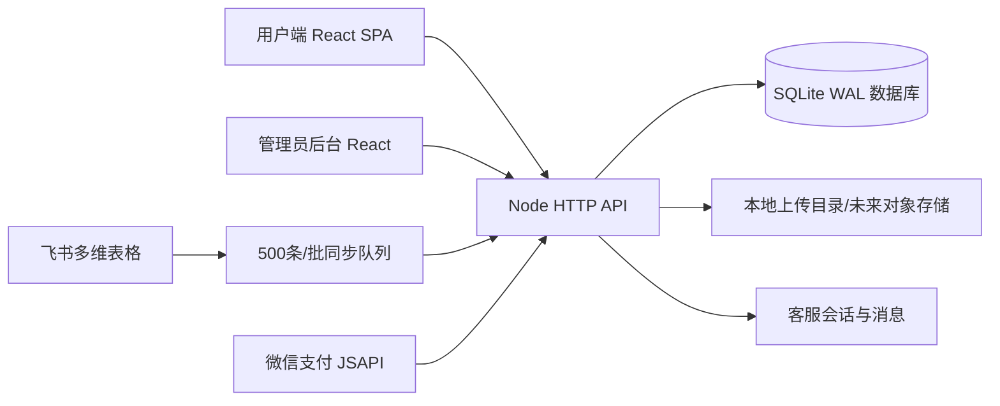
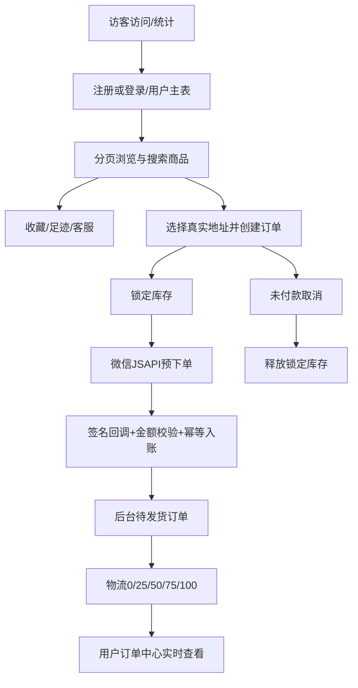

# 当前项目完整架构整理与优化分析报告

更新时间：2026-07-14。本报告基于现有代码、真实 SQLite 结构和运行中接口整理，未重建数据库、未删除原有功能。

## 1. 系统架构与当前状态

- ✅ 前端：React 19 + TypeScript + Vite，包含市场、场馆、品种、宠物详情、搜索、收藏/购物车、用户中心、地址、订单、客服等页面。
- ✅ 后端：Node.js 24 原生 HTTP 服务，使用参数化 SQL、管理员签名令牌、分页接口和增量迁移。
- ✅ 管理后台：商品/SKU/库存、订单、物流、用户、投诉/售后、Banner/分类、飞书同步、操作日志已接真实 API。
- ✅ 数据库：SQLite 已启用 WAL、外键、5 秒 busy timeout；`integrity_check=ok`，外键检查无异常。
- ✅ 真实数据链：用户登录、收藏、足迹、地址、下单、支付记录、物流进度、后台查询已经落库并可回读。
- ⚠️ 微信支付代码链路已接通，但真实支付必须配置商户号、证书、APIv3 密钥和公网 HTTPS 回调后才能联调。
- ⚠️ 当前客户端仍以 `user_id` 兼容旧流程，尚未全面升级为用户 access token；正式公网运营前应列为安全 P0。
- ⚠️ 上传文件仍在本机目录，生产环境应迁移对象存储/CDN并进行病毒扫描和媒体转码。
- ⭐ 可平滑扩展营销活动、内容管理、商家多租户、数据仓库与推荐系统。

## 2. 数据库现状

执行迁移前已生成时间戳备份，迁移 `008_operational_integrity.sql`、`009_pet_browsing_indexes.sql` 只新增索引和物流事件表，没有 DROP、TRUNCATE 或重初始化。

当前关键数据量：用户 21、访客 11、宠物 10006、订单 5、收藏 14、足迹 94、消息 34。数据库使用 WAL；迁移 001—009 已记录在 `schema_migrations`。

### 用户与行为

| 表 | 关键字段 | 用途与关联 |
|---|---|---|
| `users` | id/openid/unionid/account/nickname/avatar/phone/status/last_login_at/login_method | 用户主表；关联订单、地址、行为、消息 |
| `user_auth` | user_id/auth_type/auth_value | 微信、手机号等多种登录身份 |
| `user_login_logs` | user_id/login_type/ip/user_agent/created_at | 后台可查登录轨迹 |
| `visitors` | token/user_id/first_seen/last_seen/visit_count | 游客访问统计与用户归并 |
| `favorites` | user_id/pet_id/created_at | 唯一关联具体宠物，支持刷新后恢复 |
| `follows` | user_id/seller_name | 用户关注商家 |
| `footprints` | user_id/pet_id/viewed_at | 浏览足迹 |
| `addresses` | user_id/name/phone/行政区/detail/is_default | 下单地址；默认地址切换使用事务 |
| `coupons` / `user_coupons` | 优惠规则 / user_id/coupon_id/status | 营销券与用户领取关系 |

### 商品、品种与库存

| 表 | 关键字段 | 用途与关联 |
|---|---|---|
| `categories` | name/parent_id/image/sort_order/status | 场馆和二级分类 |
| `breeds` | name/category_id/intro/origin/growth_profile/standard_body | 品种档案、起源和成长资料 |
| `pets` | category_id/breed_id/seller_id/特征/价格/status/缩略图/高清图/source/external_id | 具体宠物和主要前台数据源 |
| `pet_products` | pet_id/breed_id/seller_id/product_name/status | 商品层，将具体宠物和品种/商家绑定 |
| `pet_skus` | pet_id/sku_name/price/stock/status | 规格库存 |
| `inventory` | pet_id/sku_id/total/locked/available/threshold | 下单锁库存、取消订单释放库存 |
| `pet_images` | pet_id/url/thumbnail_url/webp_url/尺寸/sort_order | 列表缩略图和详情高清图 |
| `pet_videos` | pet_id/url/cover/duration/status/transcode_log | 商品视频及异步转码状态 |
| `inventory_deduplicate_logs` | 原库存快照/reason | 历史库存去重审计 |

### 交易、物流与售后

| 表 | 关键字段 | 用途与关联 |
|---|---|---|
| `orders` | order_no/user_id/total/payment_status/status/address_snapshot/paid_at/refund_status | 订单主表，固定保存下单时地址快照 |
| `order_items` | order_id/pet_id/sku_id/pet_snapshot/price/quantity | 固定保存下单时商品快照 |
| `payments` | order_id/payment_no/channel/amount/status/paid_at/raw_payload | 支付流水；已支付订单有唯一约束，防重复入账 |
| `logistics` | order_id/company/tracking_no/status/progress | 当前物流状态 |
| `logistics_events` | order_id/logistics_id/progress_percent/status/note/time | 0/25/50/75/100 的不可覆盖物流历史 |
| `after_sales` | order_id/user_id/type/reason/amount/result/status | 退款/售后工单 |
| `complaints` | user_id/order_id/title/content/reply/status | 客诉闭环 |

### 管理、客服与同步

| 表 | 用途 |
|---|---|
| `admins` | 管理员盐值哈希密码、角色；启动服务不再覆盖已有密码 |
| `admin_operation_logs` | 记录资源、动作、管理员、IP和详情 |
| `customer_service_sessions` / `messages` | 用户、商品、商家、服务类型、会话状态与完整聊天记录 |
| `banners` | 首页内容管理 |
| `feishu_sync_configs` | 飞书 App/Base/Table 与字段映射配置 |
| `feishu_sync_tasks` / `sync_task_errors` | 500 条批次进度、暂停/继续/重试和逐行错误 |
| `api_rate_limits` | 接口限流桶预留 |
| `schema_migrations` | 已应用迁移审计 |

兼容视图 `products`、`pet_categories` 保留了外部系统常用命名，不改变现有实体表。

## 3. 管理员后台检查

- 登录：`admin / 123456789`，密码使用 scrypt + 独立 salt；令牌使用 HMAC 签名并带过期时间。
- 权限：`/api/admin/*` 除登录外统一校验管理员令牌；畸形令牌返回 401，不再触发 500。
- 数据连接：仪表盘改为读取 `/api/admin/stats`，商品、订单、用户、物流、售后、同步均查询真实数据库，不再显示固定统计卡片。
- 操作审计：新增/修改商品、订单、物流等管理动作写入 `admin_operation_logs`。
- ⚠️ 目前只有角色字段，尚未实现菜单/资源级 RBAC；多管理员运营前应增加角色权限表和强制改密/登录限流。

## 4. 飞书连接

现有后台配置可保存文档链接、App Token、Table ID 与字段映射。远程同步要求 `FEISHU_APP_ID`、`FEISHU_APP_SECRET`，服务端取得 tenant token 后读取 Bitable records；空字段保持为空，不伪造宠物资料。外部 `record_id` 保存为 `external_id`，再次同步会更新对应商品，避免名称相同造成错误关联。任务支持暂停、继续、失败重试和错误查看。

✅ 已使用 App ID `cli_a902ca6a2cb85cc0`、现有 Base 和数据表 `tblUaCqyE3xkk1Bj` 完成真实连接、表结构增量补齐与远程读取。任务 #14 共读取 4 条、成功写入 4 条、失败 0 条；每条记录均保留主图和视频，并通过飞书 `record_id` 与本地商品唯一关联。同步会规范化场馆、中文商品状态和完整商品资料，不会按名称误关联或重复创建。App Secret 仅通过服务端环境变量注入，未写入源码。生产建议将同步处理迁移到独立 worker/Redis 队列，并将飞书临时媒体地址转存对象存储。

## 5. 完整数据流与闭环

- 用户 ID 正确关联订单；订单保存商品和地址快照，避免后续商品编辑污染历史订单。
- 后台商品修改直接更新数据库，前台分页接口读取同一数据源。
- 订单创建锁库存；未付款订单禁止后台发货；未付款取消会释放库存。
- 支付回调验证微信平台签名、解密通知、校验金额，以微信交易号入账；唯一索引和幂等查询防止重复支付。
- 后台更新物流会新增事件并同步订单状态，用户端展示百分比和单号。

## 6. API 摘要

用户端：`/api/users/login`、`/api/visitors/session`、`/api/pets`、`/api/pets/:id`、`/api/categories`、`/api/favorites`、`/api/follows`、`/api/footprints`、`/api/addresses`、`/api/orders`、`/api/orders/:id/cancel`、`/api/payments/mock`、`/api/payments/wechat/prepay`、`/api/payments/wechat/notify`、`/api/messages`、`/api/coupons`。

后台：`/api/admin/login`、`/api/admin/stats`、`/api/admin/db/status`、商品 CRUD/SKU/媒体、订单详情与状态、物流、用户详情、投诉/售后、Banner/分类、飞书配置/任务/暂停/恢复/重试/错误、操作日志。

## 7. 性能、稳定性与风险

- ✅ 商品接口强制分页，默认 12 条；后台最大页尺寸受限，避免 10000 条全量响应。
- ✅ 前端列表使用懒加载/缩略图，详情先展示框架和基础信息，再加载完整资料。
- ✅ 商品、订单、支付、物流等查询增加索引；SQLite WAL 允许读写并行。
- ✅ 请求体限制 25MB，避免超大 JSON 占满内存。
- ✅ 接口自动测试使用独立临时数据库，不接触真实数据。
- ⚠️ 10000+ 商品在单机 SQLite 可用，但 50000—100000 商品、高并发订单或多实例部署应迁移 PostgreSQL/MySQL，并使用 Redis 缓存和队列。
- ⚠️ API 基址目前硬编码本机地址，应改为 Vite 环境变量以支持部署域名。
- ⚠️ 用户侧接口需补用户 token、资源所有权中间件、CSRF/重放防护和限流。
- ⚠️ 真实微信支付尚需商户凭据和沙箱/低金额实单验收；退款 API 仍需商户证书联调。
- ⚠️ 图片压缩/WebP 字段已经存在，但生产应由对象存储处理缩略图、CDN缓存和视频转码。

## 8. 下一步优先级

1. P0：配置用户 access token 与所有权校验；配置生产 `ADMIN_TOKEN_SECRET`。
2. P0：在 HTTPS 测试域名配置微信商户证书，完成 JSAPI支付、回调与退款联调。
3. P0：将 API 基址改为环境变量，部署前后端同域反向代理。
4. P1：对象存储/CDN和异步图片/视频处理；飞书 worker 独立进程。
5. P1：补投诉/售后的用户端发起页、退款状态机和通知。
6. P2：RBAC、营销活动、运营数据仓库、推荐和商家多租户。

## 9. 本轮验证结果

- 前端 TypeScript + Vite 生产构建通过。
- Node 服务语法检查通过。
- 临时数据库全链路测试通过：管理员登录 → 商品创建 → 地址 → 订单 → 未付款禁止发货 → 支付幂等 → 物流 50% → 用户端回读。
- 真实库 `PRAGMA integrity_check` 为 `ok`，`foreign_key_check` 为空，迁移 008 已应用，原用户/商品/收藏数据保留。
- 管理后台真实统计接口正常；恶意畸形管理员令牌返回 401。
- 100 个并发首屏分页请求全部成功，最多仅返回 12 条：总耗时约 183ms、平均约 92ms、P95 约 111ms；API 进程工作集约 59MB。100 个并发精确品种请求全部成功，P95 约 1.05s。
