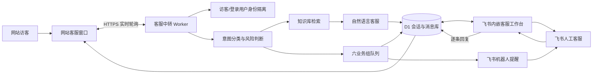

# 福宠智能客服中心商业实施方案

## 1. 完整系统架构



访客不离开网站。客服人员从飞书工作台进入内嵌网页应用，按购买、订单、售后、宠物健康、物流、官方六组查看队列；每个客户 ID 对应一条独立会话。机器人只承担手机提醒和快捷入口，不作为主要聊天界面。

## 2. 技术选型

- 前端：React 19 + TypeScript + Vite，复用现有福宠商城；网站聊天窗和飞书 H5 工作台共用消息接口。
- 后端：Cloudflare Worker，边缘处理身份校验、分类、知识库回复、转人工状态机和飞书 OAuth。
- 数据库：Cloudflare D1（SQLite），保存用户、会话、消息、队列、知识库和审计事件。
- 媒体：Cloudflare R2，后续可扩展图片、视频和文件消息。
- 实时通信：当前采用 1.8–2.5 秒增量轮询，兼容移动网络与无状态 Worker；规模上升后可替换为 Durable Objects WebSocket，接口模型不变。
- AI：第一阶段为可审计的分类器 + 结构化知识库生成自然回复；后续通过环境变量接入大模型和向量检索，不改客户端协议。
- 飞书：企业自建应用同时开启“网页应用”和“机器人”，网页应用负责完整客服工作台，机器人负责通知。

## 3. 数据库设计

核心表：

| 表 | 作用 | 关键字段 |
|---|---|---|
| `users` / `visitors` | 稳定访客身份 | `user_id`, `token`, `status` |
| `customer_service_sessions` | 独立会话与状态机 | `user_id`, `customer_code`, `group_key`, `status`, `assigned_to`, `handoff_reason` |
| `messages` | 网站、AI、人工的逐条消息 | `session_id`, `sender`, `content`, `channel`, `external_message_id` |
| `customer_service_groups` | 六组配置 | `group_key`, `label`, `feishu_chat_id`, `enabled` |
| `customer_service_knowledge` | 可运营知识库 | `group_key`, `keywords`, `answer`, `priority` |
| `customer_service_events` | 接管、结束和路由审计 | `session_id`, `event_type`, `actor`, `detail_json` |

`messages.session_id + messages.user_id` 与 `sessions.user_id` 双重校验，避免 A 用户读取 B 用户记录。飞书客服工作台必须通过飞书 OAuth 获取内部员工身份后才可访问。

## 4. API 设计

网站接口：

- `POST /api/visitors/session`：创建或恢复匿名访客身份。
- `GET /api/messages?user_id=&session_id=`：按客户和会话双重过滤历史消息。
- `POST /api/messages`：发送网站消息，自动分类、知识库回复或触发转人工。
- `GET /api/customer-service/sessions/:id?user_id=`：获取客户可见状态。
- `POST /api/customer-service/sessions/:id/handoff`：客户主动转人工。

飞书工作台接口：

- `GET /api/feishu-service/config`：返回非敏感 OAuth 配置。
- `POST /api/feishu-service/auth`：用飞书授权码换取内部客服短期令牌。
- `GET /api/feishu-service/groups`：六组队列及待接管数量。
- `GET /api/feishu-service/sessions?group_key=`：某组独立客户会话。
- `GET/POST /api/feishu-service/sessions/:id/messages`：逐条查看和回复。
- `POST /api/feishu-service/sessions/:id/takeover`：人工接管，AI 停止。
- `POST /api/feishu-service/sessions/:id/close`：结束人工，AI 恢复。
- `POST /api/integrations/feishu/events`：机器人事件回调与群绑定。

## 5. 飞书开放平台接入

1. 在企业自建应用中开启网页应用，桌面端和移动端主页均配置为生产域名的 `/feishu-service`。
2. 安全设置中加入同一 `/feishu-service` 重定向 URL。
3. 开启机器人，用于转人工和高风险消息提醒。
4. 申请发送机器人消息、接收群内 @ 消息、获取用户基本身份所需的最小权限。
5. 事件订阅地址配置为生产域名的 `/api/integrations/feishu/events`，订阅 `im.message.receive_v1`。
6. 生产环境设置 `FEISHU_APP_ID`、`FEISHU_APP_SECRET`、`FEISHU_VERIFICATION_TOKEN`，Secret 只进入托管环境。
7. 创建六个客服群或指定人员，把机器人加入群后发送“@福宠客服 绑定 购买咨询”等指令；完整处理仍在网页工作台完成。
8. 创建应用版本、设置可用范围、提交并由企业管理员发布。

## 6. 前端代码结构

```text
src/
├─ P0Modules.tsx              # 网站客服中心、六业务入口、历史与转人工
├─ FeishuServiceDesk.tsx      # 飞书内嵌客服工作台
├─ FeishuServiceDesk.css      # PC/手机双端三栏/单栏响应式界面
├─ userIdentity.ts            # 稳定用户和访客 ID
└─ main.tsx                   # /feishu-service 独立入口
```

## 7. 后端代码结构

```text
worker/index.js
├─ classifyService            # 六组自动分类
├─ handoffReason              # 投诉、退款、健康风险、连续追问判断
├─ knowledgeReply             # 知识库自然回复
├─ notifyFeishu               # 手机提醒
├─ handleFeishuEvent          # 机器人事件与回复回流
├─ handleFeishuDesk           # 飞书 H5 工作台 OAuth 和客服 API
└─ handlePublic               # 网站会话与消息 API
drizzle/027_intelligent_customer_service.sql
└─ 队列、知识库、审计与会话字段迁移
```

## 8. AI 知识库设计

知识按 `group_key` 分区，包含标题、关键词、标准答案、优先级和启用状态。首批覆盖购买推荐、订单隐私提示、售后规则、物流规则、宠物健康急症边界和综合咨询。

生产运营流程：业务负责人编辑资料 → 专业人员审核 → 灰度启用 → 查看未命中问题 → 补充 FAQ。宠物健康答案必须带“不能替代兽医诊断”边界；呼吸困难、抽搐、便血、中毒、持续呕吐等直接转人工并提示急诊。

后续接入大模型时采用 RAG：问题分类 → 按业务组检索 → 商品/订单授权数据拼接 → 模型回答 → 风险策略复核 → 回复或转人工。模型不能直接执行退款、改单和支付操作。

## 9. 部署方案

- 前端、Worker、D1 和 R2 作为同源站点部署，避免跨域和 Cookie 风险。
- D1 迁移在发布版本中执行，不重建或清空既有数据。
- 密钥使用托管平台 Secret；仓库只保留空的 `.env.example`。
- 飞书事件回调必须为 HTTPS 公网地址。
- 发布顺序：数据库迁移 → 后端接口 → 网站 UI → 飞书网页应用 → 事件订阅 → 小范围客服测试 → 扩大可用范围。
- 监控：接口错误日志、飞书推送失败、待接管时长、首响时间、会话关闭率和知识库未命中率。

## 10. 分阶段开发计划

1. 第一阶段（已实现核心）：六组入口、独立会话、历史、自动分类、知识库回复、风险转人工和移动适配。
2. 第二阶段（已实现核心）：飞书内嵌工作台、分组队列、逐条聊天、接管/结束和网站实时回流。
3. 第三阶段：飞书后台权限、回调、主页、可用范围与版本发布，完成两位访客并发隔离联调。
4. 第四阶段：导入完整商品/品牌/售后/物流知识，接入可选大模型与向量检索。
5. 第五阶段：SLA 看板、客服排班、自动分配、敏感词脱敏、满意度、工单和 CRM。
6. 第六阶段：Durable Objects WebSocket、企业微信/微信客服/小程序多渠道接入。

## 验收标准

- 两个浏览器访客并发聊天，客户 ID、会话、历史和未读完全隔离。
- 六类示例语句正确进入对应组；无法分类进入官方客服。
- 退款、投诉、高风险健康和主动要求人工会自动进入待接管。
- 飞书手机工作台可见对应队列、历史和逐条消息；人工回复 3 秒内出现在网站。
- 人工接管期间 AI 不回复；结束人工后下一条客户消息由 AI 接待。
- 未授权用户不能访问飞书客服 API；App Secret 不出现在浏览器、仓库和日志。
