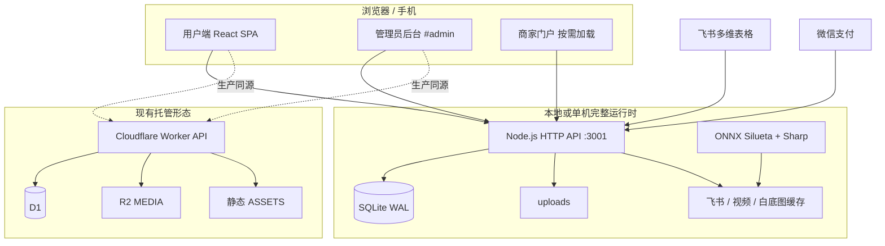
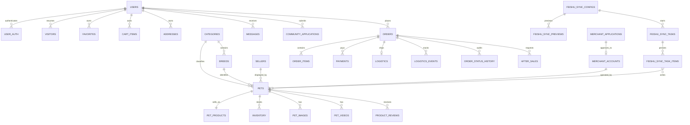
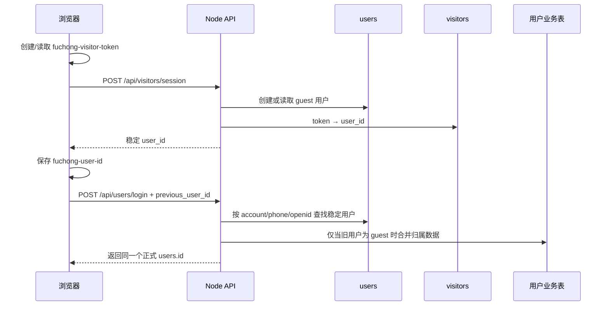
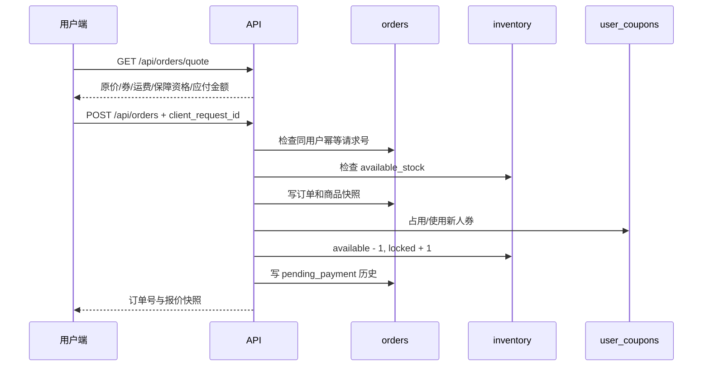
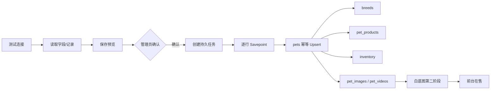
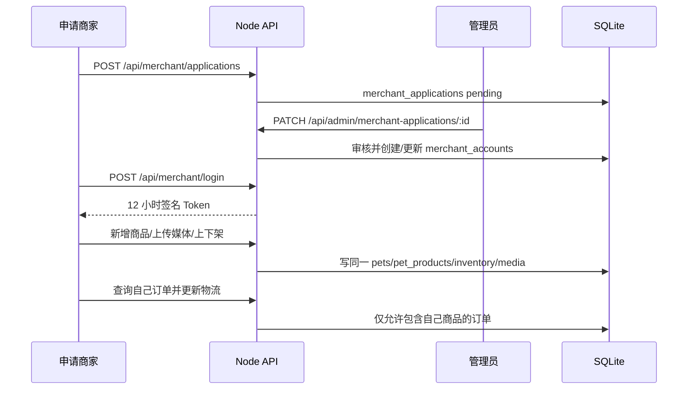

# 福宠项目全量交接：架构、数据库、数据流与开发续接说明

更新时间：2026-07-19

项目路径：`C:\Users\Administrator\Documents\Codex\2026-07-09\new-chat\workfuchong-web`

Git 基线：`main` / `55c69d0`，与 `origin/main` 同步

本地数据库基线：SQLite，49 张业务/运行表，迁移 `001`—`031`
适用范围：继续开发、排错、数据迁移、部署、验收、任务恢复和团队交接

> 本文以 2026-07-19 的真实代码、真实本地 SQLite、现有迁移和本任务中恢复出的产品约束为准。文中不保存 App Secret、支付密钥、管理员密码、商家密码、Token 或证书内容。已经在历史聊天中暴露过的 Secret 应在平台侧轮换，不能继续视为安全凭据。

## 1. 一页结论

福宠当前是一套增量开发的宠物商城系统，包含：

- React 19 + TypeScript + Vite 8 用户端 SPA。
- 同一 SPA 内的管理员后台，入口为 `#admin`。
- 按需懒加载的商家轻量经营门户。
- Node.js 原生 HTTP API + SQLite WAL 的完整本地后端。
- 飞书多维表格读取、预览、确认、持久任务、商品/媒体同步。
- 商品图片、视频、缩略图、白底宠物轮廓图和本地缓存处理。
- 用户、收藏、购物车、足迹、地址、券、订单、支付、物流、售后、客服数据。
- Cloudflare Worker + D1 + R2 + 静态资源的托管形态。

最重要的事实：

1. 本地 Node 是功能最完整的事实实现，数据库迁移已经到 `031`。
2. `worker/index.js` 和 `drizzle/` 尚未完全追平本地 Node；Drizzle 目前到 `029`，商家门户和白底处理进度不能默认在线上完整可用。
3. 公开展示商家 `sellers` 与经营登录账号 `merchant_accounts` 是两套不同概念，必须保持分离。
4. 商品、管理员后台和商家门户共用 `pets / pet_products / inventory / orders`，不能再建第二套商品或订单库。
5. SQLite 当前完整性为 `ok`，外键违规为 0，关键用户、订单、库存、飞书计数审计均通过。
6. 当前工作区有未提交的 Logo 开场动画提速改动；未经用户明确要求，不提交、不推送 Git。

## 2. 长期产品约束与用户偏好

这些不是临时建议，而是继续开发时必须保持的约束。

### 2.1 开发方式

- 在现有结构上增量开发，不推倒重做，不删除正常功能。
- 修复必须控制影响面，避免一个 Bug 修复造成用户、订单、飞书或媒体链路的连锁反应。
- 数据结构变化只新增 migration；禁止清空真实库、覆盖数据库或随意删除迁移记录。
- 每个后台按钮必须连接真实 API 和数据库，不能保留仅有视觉反馈的假按钮。
- 真实用户、商品、订单、物流和飞书数据优先于演示数据。
- 未经用户明确说“提交 Git”或“推送远程仓库”，不得提交或推送。

### 2.2 视觉与交互

- 奶油白背景、白色圆角卡片、柔和阴影、清晰层级、苹果风、干净高级。
- 需要创意和设计感，但组件必须轻量，不影响商品浏览、图片加载和滑动流畅度。
- 底部导航固定语义：市场 / 宠物家 / 客服 / 我的。
- 场馆保持双列卡片关系；二级页面要自然进入，不出现视觉断层。
- 页面都要有加载、空、错误、网络异常和可恢复状态。
- Logo 开场动画直接打开或刷新根地址时播放，约 1.85 秒内自动进入，可立即跳过；代码量和运行开销保持很小。

### 2.3 商品与媒体

- 品种标准图与具体商品实拍严格分离；品种图不能因商品白底处理而改变。
- 白底轮廓图只用于具体品种的商品橱窗、购物车和收藏等商品缩略场景。
- 白底图允许保留抱宠物的手，不强制去除所有人体区域。
- 商品详情继续使用真实高清图和视频，不用白底缩略图替代详情原图。
- 商品列表优先缩略图，详情按需加载高清图，视频必须点击或进入详情后再加载。
- 保持原画质基础上的快速加载，依靠缩略图、WebP、缓存、懒加载和 Range，而不是把所有原图强行降质。

### 2.4 商品详情业务规则

- 飞书同步价格是商品价格事实源；“平台补贴 300 / 新人专享价”是标识与券权益，不能在前端随意改写飞书价格。
- 40 天保障仅对宠物商品金额低于或等于业务门槛的订单展示，判断不含托运费；当前代码以订单报价和 `guarantee_eligible` 固化结果。
- 保障文案应克制表达“40 天内非正常养殖死亡可更换”，不能夸大为无条件承诺。
- 父系/母系档案标注纯种、3—6 年；无照片时使用卡通占位，但不显示“卡通档案”字样。
- 健康文案使用“商家已持续更新”。
- 每个商品的已售数字、评价内容和评价组合应有差异，不能所有商品复制同一组。
- 品种科普图鉴在商品详情和照护地图复用同一数据/资源，不复制两份数据库。

### 2.5 商家和后台

- `sellers` 是商品详情里平台按既有规则分配的公开商家档案。
- 新商家入驻账号是 `merchant_accounts`，只用于后台经营权限，不能改变前台展示商家的既有分配规则。
- 商家只管理自己提交的商品、店铺名称，以及包含自己商品的订单物流。
- 管理员审核入驻申请、设置或重置商家账号密码、启用/停用账号。
- 商家端、管理员端和前台必须读取同一商品与订单记录，不重复建设后台。

## 3. 总体运行架构



### 3.1 本地完整链路

```text
http://127.0.0.1:4173
  → React/Vite
  → VITE_API_BASE（开发默认 http://127.0.0.1:3001）
  → server/index.mjs
  → server/data/fuchong.db
  → server/uploads 与 server/data/*-cache
```

### 3.2 托管链路

```text
浏览器
  → 静态资源/CDN
  → 同源 /api/* Worker
  → D1（结构化数据）
  → R2（媒体对象）
```

当前 `.openai/hosting.json`：

- Sites 项目 ID：`appgprj_6a590a1449b88191abec3e404621877a`
- D1 绑定名：`DB`
- R2 绑定名：`MEDIA`
- 静态资源绑定：`ASSETS`

历史文档记录的托管地址带 `chatgpt.site` 后缀。该地址是否适合中国大陆长期访问必须重新做移动、联通、电信实测，不能将免费托管地址描述为“永久保证可用”。

## 4. 端口、地址和启动方式

| 服务 | 当前/约定端口 | 地址 | 说明 |
|---|---:|---|---|
| 前端本地预览 | 4173 | `http://127.0.0.1:4173/` | 当前实际监听；用户端入口 |
| 管理员后台 | 4173 | `http://127.0.0.1:4173/#admin` | 与用户端同一 SPA |
| Logo 强制跳过 | 4173 | `http://127.0.0.1:4173/?logo-intro=0` | 排错或性能测试用 |
| Node API | 3001 | `http://127.0.0.1:3001/` | 当前实际监听 |
| API 健康检查 | 3001 | `http://127.0.0.1:3001/api/health` | 当前返回 `ok=true, database=true` |
| Vite 默认开发端口 | 5173 | 自动 | 未显式传 `--port 4173` 时可能使用 |
| Wrangler 常用本地端口 | 8787 | 自动 | 仅 Worker 本地调试时使用，当前未监听 |
| SQLite | 无 TCP 端口 | `server/data/fuchong.db` | 文件数据库，不允许当网络端口访问 |

推荐本地启动：

```powershell
npm ci
npm start --prefix server
npm run dev -- --host 127.0.0.1 --port 4173
```

生产预览：

```powershell
npm run build
npm start --prefix server
npm run preview -- --host 0.0.0.0 --port 4173
```

## 5. 技术栈和依赖边界

| 层 | 技术 |
|---|---|
| UI | React 19.2、React DOM、TypeScript 6 |
| 构建 | Vite 8、Oxlint、Cloudflare Vite Plugin |
| 本地 API | Node.js 24+ 原生 `http`、`node:sqlite` |
| 本地数据库 | SQLite WAL |
| 图片处理 | Sharp |
| 白底轮廓 | ONNX Runtime Node + Silueta 模型 |
| 视频处理 | ffmpeg-static、HTTP Range |
| 边缘运行 | Cloudflare Worker、D1、R2、ASSETS |
| 外部内容 | 飞书开放平台 / 多维表格 |
| 支付 | 微信支付 JSAPI 预留和本地完整签名/回调实现 |

前端没有引入大型状态库、UI 框架或动画库。当前状态由 React hooks、事件模块和少量按用户隔离的 localStorage 完成。

## 6. 目录与代码职责

| 路径 | 职责 |
|---|---|
| `src/main.tsx` | React 入口 |
| `src/App.tsx` | 页面总路由状态、市场、场馆、品种、商品详情、照护、公益和主导航 |
| `src/Admin.tsx` | 管理后台登录、仪表盘、商品、用户、订单、交易、物流、售后、商家、内容、评价、飞书 |
| `src/MerchantPortal.tsx` | 商家申请、登录、店名、同库商品、媒体和订单物流；懒加载 |
| `src/UserModules.tsx` | 登录、收藏、关注、足迹、地址、券、订单、客服等用户模块 |
| `src/P0Modules.tsx` | 关键用户流程兼容模块 |
| `src/catalog.ts` | 场馆、品种、静态科普目录 |
| `src/domain.ts` | 前端领域类型与状态映射 |
| `src/cartStore.ts` | 本地购物车缓存、服务端购物车和登录合并 |
| `src/userIdentity.ts` | 当前 `user_id` 存储与跨组件通知 |
| `src/visitor.ts` | 游客令牌创建、恢复和服务端会话 |
| `src/dataEvents.ts` | 前后台同页的数据变更通知 |
| `src/imagePipeline.ts` | 商品图片 URL、缩略图/高清策略 |
| `src/mediaUrl.ts` | 本地、同源、飞书代理媒体地址归一化 |
| `src/BrandIntro.tsx` | 轻量 Logo 开场、硬性自动退出和精确线条遮罩 |
| `server/index.mjs` | 完整 Node API、事务、鉴权、飞书、支付、媒体与后台任务 |
| `server/schema.sql` | 初始结构；最终结构必须叠加全部迁移理解 |
| `server/migrations/` | 本地正式迁移 `001`—`031` |
| `server/showcase-thumbnail.mjs` | 白底轮廓图推理、合成、输出 WebP |
| `server/models/silueta.parts/` | 拆分提交的 ONNX 模型部件 |
| `server/data/` | SQLite、媒体缓存、组装模型；不提交真实数据 |
| `server/uploads/` | 本地上传资源 |
| `server/backups/` | 每日/人工 SQLite 备份 |
| `server/data-audit.mjs` | 只读业务一致性审计 |
| `server/api.test.mjs` | 用户—订单—支付—物流全链路测试 |
| `server/merchant-api.test.mjs` | 商家审核、同库商品、媒体和权限隔离测试 |
| `worker/index.js` | Worker/D1/R2 API；功能尚未完全追平 Node |
| `drizzle/` | D1 SQL 迁移副本，目前到 `029` |
| `scripts/migrate-production-data.mjs` | SQLite → D1 分表、分批迁移 |
| `vite.config.ts` | React、Sites、Cloudflare Worker、D1/R2 和静态缓存配置 |
| `.openai/hosting.json` | Sites 项目与绑定名 |
| `public/` | Logo、品种图、商家图、科普图等稳定静态资源 |

## 7. 前端页面与状态

### 7.1 用户端 Page 状态

`src/App.tsx` 当前页面枚举：

```text
home / search / hall / breed / detail / family / service / me / care /
charity / login / orders / favorites / follows / footprints / addresses /
coupons / settings / about / agreement / privacy / merchant
```

核心点击链路：

```text
首页 → 场馆 → 品种 → 商品橱窗 → 商品详情
商品详情 → 收藏 / 购物车 / 客服 / 商家档案 / 下单
我的 → 登录 / 订单 / 收藏 / 关注 / 足迹 / 地址 / 优惠券 / 商家入驻
更多馆 → 新品种申请 / 领养 / 公益 / 照护地图
```

### 7.2 管理后台页签

```text
dashboard / products / users / orders / transactions / logistics /
afterSales / other / merchants / reviews / content / feishu
```

### 7.3 商家门户页签

```text
apply / login / dashboard / products / orders
```

商家组件通过 `lazy(() => import('./MerchantPortal'))` 按需加载；不进入商家页就不下载该模块，避免影响商品前台首屏。

### 7.4 浏览器本地状态

| Key | 含义 |
|---|---|
| `fuchong-user-id` | 当前用户主键 |
| `fuchong-user` | 当前用户展示资料缓存 |
| `fuchong-visitor-token` | 游客稳定令牌 |
| `fuchong-cart:{userId}` | 按用户隔离的购物车离线缓存 |
| `fuchong-admin-token` | 管理员 Bearer Token |
| `fuchong-merchant-token` | 商家 Bearer Token |
| `fuchong-address-draft:{userId}` | 地址表单草稿 |
| `fuchong-order-notice` | 订单通知偏好 |
| `fuchong-service-notice` | 客服通知偏好 |
| `fuchong-cache:*` | 可清理的前端缓存 |

注意：普通用户目前主要依赖 `user_id` 参数，尚未全面实现用户 access token 和资源所有权中间件，这是上线前的 P0 安全任务。

## 8. 数据库运行规则

- 数据库：`server/data/fuchong.db`。
- 连接模式：`foreign_keys=ON`、`journal_mode=WAL`、`synchronous=NORMAL`、`busy_timeout=5000`。
- API 启动时先创建当日 `VACUUM INTO` 备份，再执行未应用迁移。
- 每个迁移在事务中执行，失败回滚，不写入 `schema_migrations`。
- 商品、订单、库存、支付、物流等关键写操作使用显式事务。
- 订单确认和管理员确认付款使用 `BEGIN IMMEDIATE`，并提供幂等返回和锁冲突 503 可重试提示。
- 测试使用独立临时数据库，不能覆盖真实业务库。

## 9. 2026-07-19 真实数据库快照

### 9.1 健康状态

| 检查 | 结果 |
|---|---|
| 表数量 | 49 |
| 已执行迁移 | 31 |
| 最新迁移 | `031_merchant_onboarding_portal.sql` |
| `PRAGMA integrity_check` | `ok` |
| 外键违规 | 0 |
| 重复手机号用户 | 0 |
| 孤立收藏/购物车/订单/地址/认证 | 0 |
| 订单金额不一致 | 0 |
| 负库存/超分配库存 | 0 |
| 商家商品品种关系错误 | 0 |
| 飞书任务/媒体计数错误 | 0 |
| 卡住的白底处理项 | 0 |

信息项：当前有 3 组已发布商品重名、14 个已发布商品尚无已发布评价。这两项不是结构损坏，但后续内容运营应处理。

### 9.2 全表数据字典与行数

#### 用户、身份和行为

| 表 | 行数 | 关键字段 / 关系 | 责任 |
|---|---:|---|---|
| `users` | 71 | `id, account, phone, openid, wechat_openid, unionid, login_method, status` | 用户事实主表 |
| `user_auth` | 37 | `user_id → users`, `auth_type + auth_value` | 多种认证标识 |
| `user_login_logs` | 31 | `user_id, login_type, ip, user_agent` | 登录审计和活跃统计 |
| `visitors` | 50 | `token, user_id → users, visit_count` | 游客恢复与合并来源 |
| `favorites` | 20 | `user_id + pet_id` | 收藏，组合唯一 |
| `follows` | 3 | `user_id + seller_name` | 关注公开商家 |
| `footprints` | 363 | `user_id + pet_id + viewed_at` | 浏览足迹 |
| `cart_items` | 2 | `user_id + pet_id, quantity, selected` | 服务端购物车真值 |
| `addresses` | 11 | `user_id, name, phone, region, detail, is_default` | 收货地址 |

#### 商品、分类、库存和媒体

| 表 | 行数 | 关键字段 / 关系 | 责任 |
|---|---:|---|---|
| `categories` | 181 | `parent_id, name, image, sort_order, status` | 六大场馆和层级目录 |
| `breeds` | 11 | `category_id, name, origin, intro, growth_profile, alias, evolution` | 品种科普事实 |
| `pets` | 196 | `category_id, breed_id, seller_id, merchant_account_id, source, external_id, business_id, status` | 宠物/商品档案主表 |
| `pet_products` | 196 | `pet_id, breed_id, seller_id, status, showcase_status` | 销售可见性和白底处理状态 |
| `pet_skus` | 176 | `pet_id, sku_name, price, stock, status` | SKU 层 |
| `inventory` | 199 | `pet_id, sku_id, total_stock, locked_stock, available_stock` | 交易库存真值 |
| `inventory_deduplicate_logs` | 19748 | 原库存、原因、时间 | 历史去重审计，不参与前台读取 |
| `pet_images` | 191 | `pet_id, url, thumbnail_url, webp_url, type, sort_order` | 主图、相册、档案图 |
| `pet_videos` | 16 | `pet_id, url, cover_url, duration, status, transcode_log` | 商品视频与兼容状态 |
| `product_reviews` | 84 | `pet_id, user_id, rating, content, media, likes, status` | 商品评价 |

#### 公开商家与经营商家

| 表 | 行数 | 关键字段 / 关系 | 责任 |
|---|---:|---|---|
| `sellers` | 20 | `name, city, rating, sales, image_url, thumbnail_url` | 商品详情展示档案，保持原随机分配规则 |
| `seller_reviews` | 2560 | `seller_id, user_id, rating, content, tags` | 公开商家评价 |
| `seller_reports` | 0 | `seller_id, user_id, pet_id, category, status` | 举报 |
| `merchant_applications` | 4 | `application_no, requested_username, password_hash, status, reviewed_by` | 入驻申请与审核材料 |
| `merchant_accounts` | 1 | `application_id, username, password_hash, shop_name, status` | 经营登录账号与权限主体 |

严禁将 `sellers.id` 当成 `merchant_accounts.id`。`pets.seller_id` 控制前台展示，`pets.merchant_account_id` 控制经营归属。

#### 订单、支付、物流与售后

| 表 | 行数 | 关键字段 / 关系 | 责任 |
|---|---:|---|---|
| `daily_order_sequences` | 4 | `sequence_date, last_value` | 生成 `FCYYYYMMDD-####` |
| `orders` | 14 | `order_no, user_id, amounts, payment_status, status, client_request_id, guarantee_*` | 订单主表 |
| `order_items` | 14 | `order_id, pet_id, sku_id, pet_snapshot, price, quantity` | 下单快照 |
| `order_status_history` | 15 | `order_id, from_status, to_status, operator_type/id` | 状态审计 |
| `payments` | 2 | `order_id, payment_no, channel, amount, status, raw_payload` | 支付流水 |
| `logistics` | 5 | `order_id, company, tracking_no, status, progress` | 当前物流状态 |
| `logistics_events` | 6 | `order_id, logistics_id, progress_percent, status, note` | 物流时间线 |
| `after_sales` | 0 | `order_id, user_id, type, reason, amount, result, status` | 售后/退款申请 |
| `complaints` | 0 | `user_id, order_id, title, content, reply, status` | 投诉 |

#### 优惠、客服、社区和运营

| 表 | 行数 | 关键字段 / 关系 | 责任 |
|---|---:|---|---|
| `coupons` | 1 | `title, amount, threshold, code, status` | 优惠券模板 |
| `user_coupons` | 20 | `user_id, coupon_id, status, reserved_order_id` | 用户券实例 |
| `customer_service_sessions` | 15 | `user_id, product_id, seller_id, service_type, status` | 商品/订单/售后咨询会话 |
| `messages` | 54 | `user_id, session_id, sender, type, content, product_id, seller_id` | 客服与系统消息 |
| `community_applications` | 2 | `application_type, subject, applicant, user_id, status, admin_reply` | 新品种、领养、公益申请 |
| `banners` | 2 | `title, image, link, sort_order, status` | 首页运营内容 |

#### 飞书同步

| 表 | 行数 | 关键字段 / 关系 | 责任 |
|---|---:|---|---|
| `feishu_sync_configs` | 1 | `app_token, table_id, field_mapping, status, app_id` | 非 Secret 配置 |
| `feishu_sync_previews` | 11 | `config_id, stats_json, items_json, errors_json, task_id` | 确认前预览 |
| `feishu_sync_tasks` | 9 | `total/processed/success/failed, batch_size, media_*` | 商品与媒体两阶段进度 |
| `feishu_sync_task_items` | 78 | `task_id, row_no, payload, status, pet_id, showcase_status` | 每行持久化状态 |
| `sync_task_errors` | 32 | `task_id, row_no, payload, error` | 逐行错误审计 |

飞书非密钥标识：App ID `cli_a902ca6a2cb85cc0`，Table ID `tblUaCqyE3xkk1Bj`。App Secret 只能存在服务端环境变量。

#### 管理、审计和运行表

| 表 | 行数 | 关键字段 / 关系 | 责任 |
|---|---:|---|---|
| `admins` | 1 | `username, password_hash, salt, role` | 管理员账户 |
| `admin_operation_logs` | 124 | `admin_id, action, resource, resource_id, detail, ip` | 后台审计 |
| `api_error_logs` | 42 | `request_id, method, path, message, stack` | 历史接口错误；行数不等于当前故障 |
| `api_rate_limits` | 0 | `key, bucket, count, reset_at` | 持久限流预留；当前 Node 使用内存桶 |
| `schema_migrations` | 31 | `name, applied_at` | 迁移事实 |

## 10. 数据关系总图



## 11. 用户身份与数据归属流



归属规则：

- 同一手机号/账号再次登录应返回原 `users.id`，不能创建重复正式用户。
- 登录前游客数据仅能从状态为 guest 的旧用户合并。
- 收藏、关注、足迹、购物车、地址、券、消息、订单均以 `user_id` 为边界。
- 本地购物车只是离线缓存，服务端 `cart_items` 是跨设备事实源。
- `/api/cart/merge` 以用户+商品幂等合并，数量取合理值，避免重复叠加。
- 当前最大的安全缺口是用户端尚无完整 access token；不能只因为请求携带 `user_id` 就认为它有权访问该资源。

## 12. 商品、可见性和前台展示流

一个前台可售商品至少同时满足：

```text
pets.status = 'published'
AND pet_products.status = 'available'
AND inventory.available_stock > 0（需要库存的场景）
```

商品来源：

```text
管理员新增 ─┐
飞书同步 ───┼→ pets → pet_products → inventory → pet_images/pet_videos
商家提交 ───┘                                  ↓
                                     前台 / 后台 / 商家端同库读取
```

关键标识：

- `pets.id`：数据库主键。
- `pets.business_id`：业务识别码。
- `pets.source + pets.external_id`：飞书等外部来源幂等键。
- `pets.breed_id`：结构化品种关系；`pets.breed` 是展示文本。
- `pets.seller_id`：公开商家档案。
- `pets.merchant_account_id`：经营权限归属。
- `pet_products.status`：销售可见性。
- `pet_products.showcase_status`：白底轮廓图任务状态。

迁移 `029` 已修复“后台上架但前台无商品”的双状态不一致：发布商品对应 `available`，售出对应 `sold`，其余对应 `offline`。

## 13. 图片、视频和白底轮廓处理流

### 13.1 浏览路径

```text
商品列表/品种橱窗
  → 420px WebP 或 showcase_image
  → lazy loading
  → 点击详情
  → 1200px/原图按需加载
  → 视频只在需要时请求
  → Range 206 流式播放
```

### 13.2 飞书媒体代理

- 前端不接触飞书 Secret 或 tenant token。
- `/api/media/feishu` 只允许 HTTPS 且域名/路径必须匹配飞书媒体接口，避免任意 SSRF。
- 原图、缩略图和视频兼容文件落入本地缓存。
- 同一个媒体请求通过 Map 合并，避免并发重复下载/转码。
- 静态资源和生成文件使用长期缓存；失败时返回明确错误，不无限显示“正在加载”。

### 13.3 白底商品轮廓

```mermaid
flowchart LR
  Main[商品主图] --> Queue[单并发队列]
  Queue --> Sharp[旋转/缩放到 360]
  Sharp --> ONNX[Silueta 320x320 分割]
  ONNX --> Mask[羽化主体遮罩]
  Mask --> White[420x420 白底合成]
  White --> WebP[WebP q86]
  WebP --> Cache[showcase-image-cache]
  Cache --> Showcase[/api/media/product-showcase/:petId]
```

- 推理线程默认最多 2，可用 `SHOWCASE_IMAGE_THREADS` 调整。
- 实际任务并发固定为 1，避免 500 张同步时抢光 CPU/内存导致 API 卡死。
- 相同源图按 SHA-256 身份去重，同一任务只处理一次。
- 状态：`not_required → pending → processing → success/failed`。
- 飞书任务把商品同步和媒体处理分为两个阶段，媒体计数单独落库。
- 商家上传主图后进入同一白底处理队列，不新建处理系统。
- 白底图只改变商品缩略展示；品种图、商品详情原图和视频不变。

### 13.4 Logo 开场性能

- 不引入动画库或新图片资源。
- 复用现有 Logo，临时遮罩只按逻辑 220×220 处理，高 DPI 下不把像素循环放大 4 倍。
- CSS 使用渲染隔离和合成层，移除高开销背景模糊。
- `onClose` 在父组件稳定化，首页数据更新不会重置计时器。
- 1.85 秒硬性退出；Logo 解码失败也不会阻止进入首页。

## 14. 购物车、报价、优惠和下单流



事务内完成：订单主表、订单明细、券状态、状态历史、库存锁定。任何一步失败都回滚。

金额字段：

- `subtotal_amount`：商品标价。
- `discount_amount`：优惠金额。
- `shipping_fee`：托运费。
- `total_amount`：实际应付。
- `order_items.price`：下单时商品成交快照。
- `guarantee_eligible / guarantee_policy`：下单时固化的保障判定，不依赖后续前端再次计算。

## 15. 支付、确认、物流和售后状态流

### 15.1 正常订单状态

```text
pending_payment
  → pending_confirm（支付成功或管理员确认到账）
  → pending_ship（管理员确认订单）
  → packed
  → shipped
  → in_transit
  → delivering
  → pending_receive
  → completed
```

旁路：`cancelled`、`after_sale`。支付状态独立存储为 `unpaid / paid / refunded` 等，不应只看订单状态推断支付结果。

### 15.2 管理员确认付款

- `POST /api/admin/orders/:id/payment`。
- `BEGIN IMMEDIATE` 获取写事务，减少并发重复确认。
- 已支付直接返回幂等成功。
- 取消、完成、售后或已退款订单拒绝确认付款。
- 写入唯一支付流水、更新 `payment_status`、必要时进入 `pending_confirm`。
- 审计日志失败不能回滚已经成功的付款事务。
- SQLite busy/locked 返回 503、`retryable=true`，前端可以安全重试。

### 15.3 管理员确认订单

- `POST /api/admin/orders/:id/confirm`。
- 只有 `payment_status='paid'` 且状态为 `pending_confirm` 才改变为 `pending_ship`。
- 重复确认返回当前订单和 `idempotent=true`，不重复写状态历史。

### 15.4 物流

物流百分比映射：

| 物流状态 | 百分比 | 订单状态 |
|---|---:|---|
| `pending` | 0 | 不变 |
| `packed` | 25 | `packed` |
| `shipped` | 50 | `shipped` |
| `in_transit` | 65 | `in_transit` |
| `delivering` | 75 | `delivering` |
| `pending_receive` | 90 | `pending_receive` |
| `delivered` | 100 | `completed` |

物流不允许百分比回退；物流当前值、事件、订单状态和最终库存释放在同一事务中更新。用户端订单详情和后台读取同一组表。

### 15.5 售后

- 未付款订单不能创建售后，直接取消即可。
- 同一订单同一用户只允许一个 `pending/processing` 售后。
- 创建售后与订单进入 `after_sale`、退款状态进入 `pending` 同事务完成。
- 售后处理完成后由后台按结果更新订单、退款和库存，必须写状态审计。

## 16. 飞书同步与数据处理流



### 16.1 幂等和批量规则

- `source='feishu' + external_id=record_id` 唯一识别商品。
- 同一记录再次同步更新原商品，不重复新增。
- 空字段不应覆盖已有正确资料。
- 每个任务保存原始 items，服务重启后可恢复未完成任务。
- 每批最大 500，后台可配置较小批量；每行使用 Savepoint，单行失败不污染同批其他行。
- 商品、品种、公开商家分配、销售状态、库存、图片和视频在同步流程中一并维护。
- 同步结束后进入白底媒体阶段；`media_total/processed/success/failed/status` 是真实计数，不是前端模拟进度。
- 暂停、继续、重试和错误明细均基于持久表，不依赖浏览器页面存活。

### 16.2 飞书字段建议

商品名称、场馆、品种、性别、价格、详细介绍、主图文件、视频文件、年龄（月）、毛色、体型、性格、健康状态、疫苗记录、父亲信息、母亲信息、商家名称、商品状态、库存、宠物识别码、品种起源、别名、演化说明。

### 16.3 当前边界

- 本地 Node 支持完整读取、预览、确认、持久任务和媒体阶段。
- Worker 当前反向写回飞书返回 501；未配置写权限前不能宣称双向同步。
- 缺少 `FEISHU_APP_SECRET` 时必须明确失败，不能伪造成功。
- 500 张图片可排队稳定处理，但总耗时取决于飞书网络、图片大小和 CPU；单并发是以稳定换吞吐。

## 17. 社区、领养、公益和照护地图

`community_applications.application_type`：

- `breed`：新品种/稀有宠物档案申请。
- `adoption`：领养申请。
- `charity`：公益活动报名。

流转：

```text
前端真实表单
  → POST /api/community-applications
  → community_applications(status='pending')
  → 管理后台“其他”/社区模块
  → processing / approved / rejected / completed
  → admin_reply 返回用户查询
```

照护地图和品种科普应复用 `breeds`、`catalog.ts` 与同一科普资源，避免为每个入口重复建表。每个照护板块应有不同、详细、带福宠品牌语气的内容，但首屏只加载必要摘要，详情点击后再展开。

## 18. 商家入驻和轻量经营门户



权限边界：

- 商家查询必须追加 `merchant_account_id = token.sub`。
- 商品创建写 `pets.merchant_account_id`，并同步写 `pet_products`、`inventory`。
- 商家不能读取或修改其他商家的商品。
- 商家订单仅包含 `order_items.pet_id` 归属自己的订单。
- 更新物流前必须确认订单已支付。
- 管理员可以审核、停用、重置用户名或密码。
- 密码使用随机 salt + scrypt 哈希，不存明文。
- 商家 Token 12 小时，密码变化后凭据版本改变，旧 Token 失效。

## 19. 管理后台真实数据来源

| 后台模块 | 数据来源 |
|---|---|
| 仪表盘商品 | `pets / pet_products / inventory` 聚合 |
| 用户 | `users / user_login_logs / visitors` |
| 订单趋势 | `orders` 按真实创建日期和状态聚合 |
| 营收 | 已支付订单 `SUM(total_amount)` |
| 交易流水 | `payments` |
| 物流 | `logistics / logistics_events / orders` |
| 售后 | `after_sales / complaints / seller_reports` |
| 社区申请 | `community_applications` |
| 商家入驻 | `merchant_applications / merchant_accounts` |
| 评价 | `product_reviews / seller_reviews` |
| 飞书 | `feishu_sync_* / sync_task_errors` |
| 错误与审计 | `api_error_logs / admin_operation_logs` |

禁止在前端生成随机趋势冒充真实运营数据。如果某一天趋势为 0，应先确认当天是否确实没有订单、登录或足迹。

## 20. API 总表

### 20.1 公共、商品和媒体

| 方法 | 路径 | 用途 |
|---|---|---|
| GET | `/api/health` | API/数据库健康 |
| GET | `/api/categories` | 场馆和分类 |
| GET | `/api/pets` | 分页、搜索、状态过滤商品 |
| GET | `/api/pets/breed-counts` | 品种在售数 |
| GET | `/api/pets/:id` | 商品详情、媒体、库存、评价 |
| GET | `/api/sellers/:id` | 公开商家档案和评价 |
| POST | `/api/sellers/:id/reports` | 举报商家/商品 |
| POST | `/api/reviews/:id/like` | 评价点赞 |
| GET | `/api/media/feishu` | 飞书授权媒体代理 |
| GET | `/api/media/product-showcase/:petId` | 白底商品缩略图 |
| GET | `/uploads/*` | 本地/R2 上传资源 |

### 20.2 用户、行为和客服

| 方法 | 路径 | 用途 |
|---|---|---|
| POST | `/api/visitors/session` | 创建/恢复游客 |
| POST | `/api/users/login` | 稳定账号登录或注册 |
| GET/PATCH | `/api/users/:id` | 用户资料 |
| PATCH | `/api/users/:id/bind-phone` | 绑定手机 |
| POST | `/api/users/:id/auth` | 添加认证标识 |
| GET | `/api/users/:id/summary` | 用户中心数量 |
| GET/POST/DELETE | `/api/favorites[/:petId]` | 收藏 |
| GET/POST/DELETE | `/api/follows` | 关注 |
| GET/POST/DELETE | `/api/footprints[/:id]` | 足迹 |
| GET/POST/DELETE | `/api/cart[/:id]` | 购物车 |
| POST | `/api/cart/merge` | 登录后合并购物车 |
| CRUD | `/api/addresses[/:id]` | 地址 |
| GET | `/api/coupons` | 用户券 |
| GET/POST | `/api/messages` | 客服消息 |
| POST | `/api/customer-service/sessions/:id/handoff` | 转人工 |
| GET/POST | `/api/community-applications` | 用户申请提交/查询 |

### 20.3 订单、支付和售后

| 方法 | 路径 | 用途 |
|---|---|---|
| GET | `/api/orders/quote` | 下单前统一报价 |
| POST | `/api/orders` | 幂等创建订单并锁库存 |
| GET | `/api/orders` | 用户订单列表 |
| GET | `/api/orders/:id` | 订单详情、支付、物流、历史、售后 |
| PATCH | `/api/orders/:id/cancel` | 用户取消未支付订单 |
| POST | `/api/payments/mock` | 本地联调支付 |
| POST | `/api/payments/wechat/prepay` | 微信 JSAPI 预支付 |
| POST | `/api/payments/wechat/notify` | 微信验签、解密和幂等入账 |
| POST | `/api/after-sales` | 售后/退款申请 |
| POST | `/api/complaints` | 投诉 |

### 20.4 商家门户

| 方法 | 路径 | 用途 |
|---|---|---|
| POST | `/api/merchant/applications` | 入驻申请 |
| POST | `/api/merchant/login` | 商家登录 |
| GET/PATCH | `/api/merchant/me` | 当前经营主体/店名 |
| GET | `/api/merchant/catalog` | 可选场馆和品种 |
| GET/POST | `/api/merchant/products` | 自己的商品列表/新增 |
| PATCH | `/api/merchant/products/:id` | 自己商品资料和上下架 |
| POST | `/api/merchant/uploads` | 商家媒体上传 |
| POST | `/api/merchant/products/:id/images|videos` | 商品媒体 |
| GET | `/api/merchant/orders` | 含自己商品的订单 |
| PUT | `/api/merchant/orders/:id/logistics` | 更新自己订单物流 |

### 20.5 管理员

除登录外均需管理员 Bearer Token。

| 方法 | 路径 | 用途 |
|---|---|---|
| POST | `/api/admin/login` | 管理员登录 |
| POST | `/api/admin/change-password` | 修改密码并使旧 Token 失效 |
| GET | `/api/admin/stats` | 真实聚合统计 |
| GET | `/api/admin/db/status` | 完整性、外键、迁移、备份、凭据状态 |
| CRUD | `/api/admin/pets[/:id]` | 商品管理 |
| PATCH | `/api/admin/pets/bulk-status` | 批量/全部上下架 |
| GET/PATCH | `/api/admin/pets/:id/inventory` | 库存 |
| CRUD | `/api/admin/pets/:id/skus`、`/api/admin/skus/:id` | SKU |
| POST | `/api/admin/pets/:id/images|videos` | 媒体 |
| POST | `/api/admin/uploads` | 管理员上传 |
| GET | `/api/admin/users` | 用户列表 |
| GET/PATCH | `/api/admin/users/:id` | 用户详情/状态 |
| GET | `/api/admin/orders` | 订单列表 |
| GET/PATCH | `/api/admin/orders/:id` | 订单详情/允许状态更新 |
| POST | `/api/admin/orders/:id/payment` | 确认到账，幂等 |
| POST | `/api/admin/orders/:id/confirm` | 确认订单，幂等 |
| PUT | `/api/admin/orders/:id/logistics` | 物流事务更新 |
| GET | `/api/admin/payments` | 支付流水 |
| CRUD | `/api/admin/complaints`、`after-sales`、`seller-reports` | 售后处理 |
| GET/PATCH | `/api/admin/merchant-applications/:id` | 入驻审核 |
| PATCH | `/api/admin/merchant-accounts/:id` | 账号启停/重置 |
| GET/PATCH/DELETE | `/api/admin/community-applications/:id` | 社区申请管理 |
| CRUD | `/api/admin/banners`、`categories`、`coupons` | 内容运营 |
| POST | `/api/admin/coupons/:id/issue` | 发券 |
| GET/POST/PATCH | `/api/admin/reviews` | 评价查询、生成、审核 |
| GET/POST | `/api/admin/feishu/configs` | 飞书配置 |
| POST | `/api/admin/feishu/test-connection` | 连接测试 |
| GET/POST | `/api/admin/feishu/previews|preview` | 预览 |
| POST | `/api/admin/feishu/previews/:id/commit` | 确认同步 |
| GET | `/api/admin/feishu/tasks` | 任务列表和真实进度 |
| GET/POST | `/api/admin/feishu/tasks/:id/{errors|pause|resume|retry}` | 任务控制 |
| POST | `/api/admin/feishu/export-products` | 反向写回；权限不足时不可用 |
| GET | `/api/admin/logs` | 操作和错误日志 |

## 21. 安全模型

### 21.1 已实现

- 管理员和商家密码使用随机 salt + scrypt 64 字节哈希。
- Token 使用 HMAC-SHA256、过期时间和凭据版本，改密码后旧 Token 失效。
- Token 验签使用 `timingSafeEqual`，Authorization 长度和格式受限。
- 生产缺少 `ADMIN_TOKEN_SECRET` 时拒绝启动；首次启动缺少管理员初始密码时拒绝生产初始化。
- 允许来源通过 `ALLOWED_ORIGINS / APP_ORIGIN` 白名单；开发只允许本地 4173。
- 响应头包含 `nosniff`、`DENY frame`、严格 Referrer、Permissions Policy、CSP。
- 一般 JSON 请求上限 1MB，上传请求上限 14MB；商家 UI 单文件限制 10MB。
- 管理员登录 15 分钟 8 次、商家登录 15 分钟 12 次、入驻申请每小时 5 次、上传每小时 80 次等内存限流。
- 飞书媒体 URL 校验 HTTPS、域名和路径，降低 SSRF 风险。
- 管理员/商家接口校验角色、账号状态和凭据版本。
- 未捕获异常对用户只返回通用消息和 `request_id`，内部堆栈写日志。

### 21.2 上线前必须补齐

1. 普通用户 access token、授权中间件和资源所有权校验。
2. CSRF/同源策略与未来 Cookie 登录方案的统一设计。
3. 生产级分布式限流；当前内存桶不能跨多实例共享。
4. Token 不应长期存 localStorage；正式支付场景建议迁移安全 Cookie 或短期 Token + 刷新机制。
5. 管理后台增加强密码策略、登录失败告警和可选 MFA。
6. Secret 轮换、最小权限、日志脱敏和生产环境变量审计。
7. 对上传文件进行魔数、扩展名、解码、安全扫描和对象存储隔离。

## 22. 环境变量与密钥边界

| 变量 | 使用位置 | 用途 |
|---|---|---|
| `VITE_API_BASE` | 前端构建 | API 根地址；生产同源时留空 |
| `PORT` | Node | 默认 3001 |
| `DB_PATH` | Node/脚本 | SQLite 文件 |
| `PUBLIC_API_BASE` | Node | 上传资源公开根地址 |
| `NODE_ENV` | Node | 生产安全开关 |
| `ALLOWED_ORIGINS` / `APP_ORIGIN` | Node | CORS 白名单 |
| `ADMIN_TOKEN_SECRET` / `JWT_SECRET` | Node/Worker | Token 签名 |
| `ADMIN_INITIAL_PASSWORD` | Node/Worker | 首次管理员初始化 |
| `FEISHU_APP_ID` | Node/Worker | 飞书应用 ID |
| `FEISHU_APP_SECRET` | Node/Worker | 飞书 Secret，仅服务端 |
| `SHOWCASE_IMAGE_THREADS` | Node | ONNX 推理线程上限 |
| `WECHAT_PAY_*` | Node | 商户、证书、私钥、V3 Key 和回调 |
| `MIGRATION_SECRET` | Worker/迁移脚本 | SQLite → D1 导入鉴权 |
| `TARGET_URL` | 迁移脚本 | 目标站点 |
| `EXPORT_DIR` | 迁移脚本 | 可选数据导出目录 |

禁止把 Secret、私钥、密码或完整 Token 写入本文件、源码、Git、浏览器环境变量或前端日志。

## 23. Node 与 Worker 的当前差异

| 能力 | 本地 Node | Worker/D1 | 处理要求 |
|---|---|---|---|
| 数据迁移 | `001`—`031` | Drizzle 到 `029` | 先补 030/031，再迁移数据 |
| 商家门户 API | 完整 | 未完整实现 | 上线前补 Worker 或部署 Node |
| ONNX 白底轮廓 | 完整、单并发 | Worker 不适合直接跑 Node ONNX | 使用独立媒体任务或预处理结果存 R2 |
| 飞书大任务 | 持久任务、重启恢复 | 请求内能力较弱 | 迁移到队列/后台 Worker |
| 微信回调 | 完整验签/解密 | 未达到同等能力 | 保留 Node 或实现等价安全回调 |
| 用户取消 | PATCH | 历史 Worker 为 POST | 统一或双兼容 |
| 物流更新 | PUT | 历史 Worker 为 PATCH | 统一或双兼容 |
| 普通用户鉴权 | 未完成 | 未完成 | 两端同时补齐 |

任何业务改动都要检查 Node 和 Worker 是否需要同步；否则本地正常、线上失败会反复出现。

## 24. 性能与稳定性基线

- 商品 API 必须分页，禁止一次返回全部商品与全部媒体。
- 列表只返回必要字段和缩略图；详情再查询媒体、评价、商家和档案。
- 图片使用 WebP、缩略图、懒加载、长期缓存；高清图渐进加载。
- 视频使用 Range，不一次性读入内存；只在用户真正播放时加载。
- 相同飞书/白底媒体请求合并，处理结果落磁盘/R2。
- 飞书 500 条使用持久 items、Savepoint、可暂停/继续/重试。
- 白底图单并发，避免 CPU/内存峰值拖垮订单 API。
- SQLite 写事务要短；批量媒体处理不得长时间持有数据库事务。
- 所有订单状态变更保持幂等，锁冲突返回可重试信号。
- 开场动画硬性退出，不受首页接口、图片和重渲染影响。

## 25. 当前完成进度

### 25.1 已完成

- 市场、六大场馆、品种页、搜索、商品橱窗和商品详情。
- 商品详情媒体、成长记录、父母档案、繁育档案、官方检测、商家、评价和品种科普框架。
- 用户登录/游客、收藏、关注、足迹、购物车、地址、优惠券、订单、消息和客服入口。
- 更多馆、新品种申请、领养、公益报名、照护地图和后台申请管理。
- 管理后台商品搜索、上下架、库存、SKU、媒体、用户、订单、付款确认、订单确认、物流、售后、内容、评价和飞书。
- 商家入驻申请、管理员审核/设置账号、商家登录、同库商品、媒体上传、白底队列和订单物流。
- 飞书读取、预览、确认、持久任务、逐行错误和白底图真实处理进度。
- SQLite 增量迁移、备份、审计、幂等订单、库存锁定、状态历史。
- 本地静态品种图、商家图、缩略图/高清图分级、视频 Range 和媒体缓存。
- Logo 开场动画、每次新打开播放、2 秒内自动进入和低计算量优化。

### 25.2 尚未完成或上线前必须完成

1. 普通用户 Token 和全接口资源所有权校验。
2. Worker/D1 追平迁移 030、031、商家端、白底进度和本地订单语义。
3. 真实微信支付商户凭据、退款 API、低金额实单和回调验收。
4. 飞书反向写回权限和实现；当前不能宣称双向同步。
5. 生产对象存储、媒体 CDN、生命周期、容量和成本监控。
6. 中国移动/联通/电信真实外部网络、手机和电脑长期探测。
7. 正式域名、DNS、SSL、WAF 误拦截和不依赖特殊网络的部署。
8. 3 组重名商品和 14 个无评价已发布商品的内容治理。
9. 管理、商家和用户端端到端浏览器自动化测试扩充。

## 26. 当前 Git 与工作区状态

最后已提交并推送：

```text
55c69d0 feat: add animated brand logo intro
1883848 feat: add secure merchant operations and showcase media
8d4ec79 feat: track Feishu showcase image processing
```

截至本文生成前，未提交改动：

```text
M src/App.tsx
M src/BrandIntro.css
M src/BrandIntro.tsx
```

这些改动将根地址开场改为每次加载播放、时长压到约 1.85 秒，并降低高 DPI 像素处理与重渲染重置风险。本文本身也是新增未提交文件。

## 27. 测试、审计与提交前检查

```powershell
npm run lint
npm run build
npm test
node server/data-audit.mjs
git diff --check
git status --short
```

浏览器最少验收：

1. 根地址动画 2 秒内自动进入，左上角可跳过。
2. 首页、六场馆、品种橱窗和商品详情无白屏。
3. 商品缩略图、详情高清图和视频正常；白底图失败不无限加载。
4. 同一用户刷新/重新登录后收藏、购物车、地址、订单仍在。
5. 创建订单重复提交同一 `client_request_id` 只产生一个订单。
6. 管理员确认付款、确认订单和更新物流后用户端立即一致。
7. 商家只能看到自己的商品和订单；管理员可停用商家。
8. 飞书测试连接、预览、提交、真实进度、暂停/继续/重试正常。
9. `integrity_check=ok`、外键违规为 0、数据审计退出码为 0。

## 28. 故障排查表

| 现象 | 优先检查 |
|---|---|
| `127.0.0.1:4173` 无法访问 | 前端进程、4173 监听、Vite 构建错误、代理环境变量 |
| API 服务器处理失败 | 响应 `request_id`、`api_error_logs`、SQLite busy/locked、请求体是否合法 |
| 待付款改已付款失败 | 当前 payment/status、已有支付流水、`BEGIN IMMEDIATE` 锁冲突、是否安全重试 |
| 确认订单失败 | 是否已支付、是否 `pending_confirm`、重复确认应幂等成功 |
| 后台上架前台不显示 | `pets.status`、`pet_products.status`、品种/场馆映射、库存、API 缓存 |
| 商家品种匹配不上 | `categories.name` 与 `catalog.ts` 场馆名、`breeds.category_id`、`pets.breed_id` |
| 商家商品越权 | Token role/sub、`merchant_account_id` 查询条件 |
| 商品图片打不开 | URL 归一化、上传文件、飞书凭据、代理白名单、缓存文件、Content-Type |
| 白底图一直处理中 | `showcase_status/error`、模型分片、组装模型、队列、源图可读性 |
| 500 张处理卡住 | `media_*` 计数、任务 items、单并发进程、磁盘和内存；不要提高并发硬顶 |
| 视频一直加载 | Range 206、H.264 兼容缓存、文件大小、视频 MIME |
| 用户数据串号 | `fuchong-user-id`、稳定登录返回 ID、游客合并条件、接口所有权 |
| 物流前后台不同 | `logistics`、最新 `logistics_events`、`orders.status` 是否同事务 |
| 国内出现阻止页 | 域名平台、WAF/Bot/地区规则、DNS、SSL；不是只改前端即可解决 |

## 29. 继续开发的固定工作流

```text
1. 读取本文、git status、最近提交和相关模块。
2. 识别用户已有未提交改动，禁止覆盖。
3. 涉及真实数据前创建备份。
4. 数据结构只新增 migration；同步考虑 server/migrations 与 drizzle。
5. 明确数据事实源和角色所有权，再改前端按钮。
6. 修改 Node API 时检查 Worker 是否需要同样变更。
7. 修改商品可见性时同时检查 pets + pet_products + inventory。
8. 修改订单时同时检查 payment、history、inventory、logistics、after_sales。
9. 修改媒体时保持品种图、商品缩略图、详情原图三层分离。
10. 执行 lint、build、test、data-audit、diff check。
11. 浏览器实测关键链路，不能只看编译通过。
12. 用户明确要求后才 commit；明确要求推送后才 push。
13. 架构、迁移、API 或部署变化后同步更新本文。
```

## 30. 下一位开发者的最短接手路径

1. 进入项目目录并运行 `git status --short`，保留当前 Logo 未提交改动。
2. 启动 `npm start --prefix server` 和 `npm run dev -- --host 127.0.0.1 --port 4173`。
3. 打开用户端、`#admin` 和“我的 → 商家入驻”。
4. 运行 `node server/data-audit.mjs`，确认结构与业务一致性。
5. 优先完成普通用户鉴权与资源所有权，避免在未授权模型上扩大生产部署。
6. 之后补齐 Worker 的迁移 030/031、商家 API 和媒体异步处理，再做生产数据迁移。
7. 最后联调真实微信支付、退款和中国大陆三网可用性。

本文是当前统一交接基线。后续任何数据库表、迁移、API 方法、角色权限、飞书字段、媒体队列、支付状态机或部署平台变化，都必须同步更新本文，避免再次依赖零散聊天记录恢复项目。
