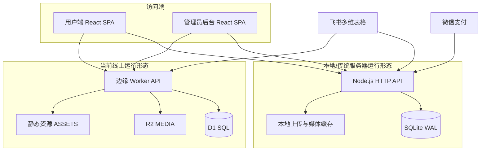
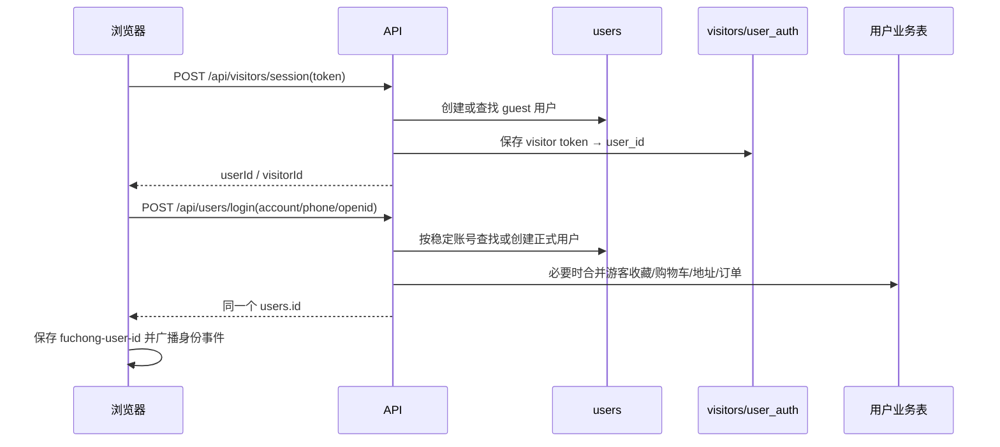
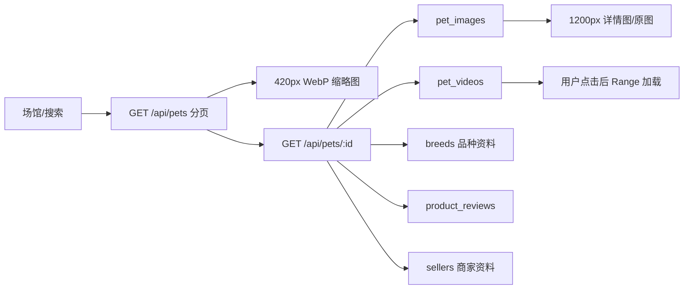
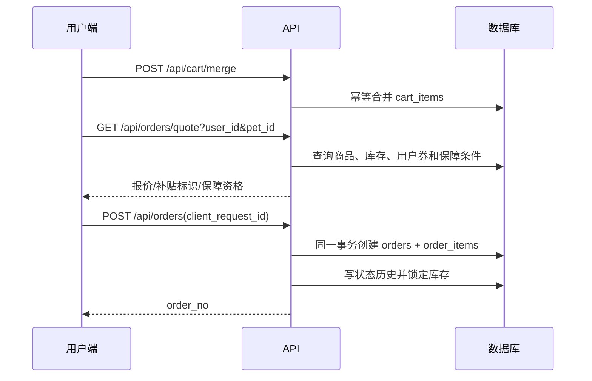
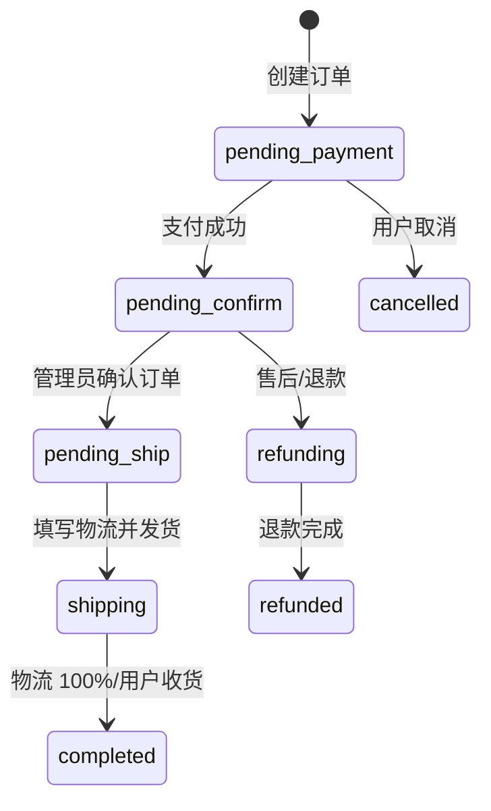
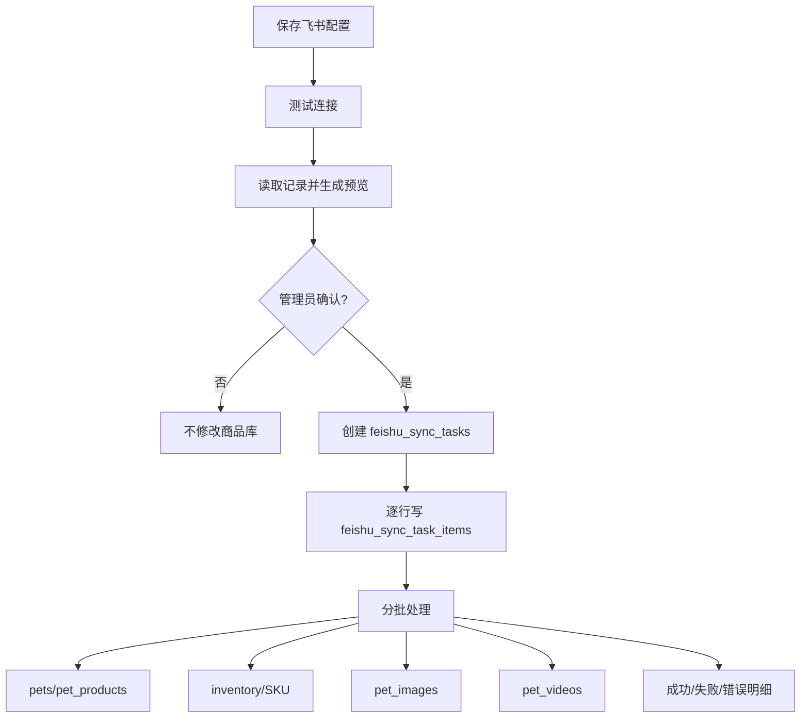

# 福宠网站全景架构、数据库与数据流说明

更新时间：2026-07-17  
适用代码基线：Git `85b67be`，数据库迁移 `001`—`027`  
项目目录：`C:\Users\Administrator\Documents\Codex\2026-07-09\new-chat\workfuchong-web`

> 本文以当前代码、真实本地 SQLite 数据库和现有线上 Worker 代码为准，供继续开发、部署迁移、数据排错和交接使用。文档不包含任何 App Secret、支付密钥、管理员密钥或迁移密钥。

## 1. 项目定位与当前状态

福宠是一个包含用户端、管理后台、商品与品种档案、用户数据库、订单交易、物流售后、客服消息、飞书同步和媒体处理的宠物商城 SPA。

当前状态：

- 用户端与管理后台共用一套 React SPA，后台入口为 `#admin`。
- 本地完整后端为 Node.js 原生 HTTP API + SQLite WAL。
- 当前线上托管版本为边缘 Worker + D1 + R2 + 静态资源。
- 飞书多维表格支持连接测试、预览、确认、任务进度、失败明细和重复记录更新。
- 微信 JSAPI 支付代码已存在；生产真实支付仍依赖商户凭据、证书及公网 HTTPS 回调。
- 本地真实数据库已通过完整性检查，46 张表，27 个迁移，外键违规为 0。
- 当前没有执行 Git 提交或推送；本文只是新增项目说明。

### 1.1 当前数据快照

以下数量来自 `server/data/fuchong.db`，是 2026-07-17 读取时的本地真实快照：

| 数据 | 数量 |
|---|---:|
| 用户 `users` | 64 |
| 访客会话 `visitors` | 46 |
| 用户认证标识 `user_auth` | 34 |
| 商品 `pets` | 188 |
| 商品销售记录 `pet_products` | 188 |
| SKU `pet_skus` | 176 |
| 库存 `inventory` | 191 |
| 商品图片 `pet_images` | 183 |
| 商品视频 `pet_videos` | 10 |
| 品种 `breeds` | 9 |
| 商家 `sellers` | 20 |
| 商品评价 `product_reviews` | 84 |
| 商家评价 `seller_reviews` | 2560 |
| 订单 `orders` | 11 |
| 订单明细 `order_items` | 11 |
| 支付记录 `payments` | 2 |
| 物流 `logistics` | 5 |
| 物流事件 `logistics_events` | 6 |
| 飞书同步任务 | 3 |
| 已执行迁移 | 27 |

数据库检查结果：`PRAGMA integrity_check = ok`，`PRAGMA foreign_key_check = []`。

## 2. 总体架构



### 2.1 前端

- 技术：React 19、TypeScript、Vite 8。
- 入口：`src/main.tsx`、`src/App.tsx`。
- 后台：`src/Admin.tsx`，通过 URL Hash `#admin` 打开。
- API 地址：开发环境默认 `http://127.0.0.1:3001`；生产环境默认同源，或通过 `VITE_API_BASE` 覆盖。
- 用户身份：浏览器保存 `fuchong-user-id`，并通过 `fuchong-identity-change` 事件同步组件状态。
- 购物车：服务端数据库是真值，本地按 `fuchong-cart:{userId}` 分用户缓存；登录后调用 `/api/cart/merge` 合并。
- 图片：列表优先 420px WebP 缩略图，详情优先 1200px 高质量图，视频按播放请求加载。

### 2.2 本地 Node 后端

- 文件：`server/index.mjs`。
- 数据库：`server/data/fuchong.db`。
- 模式：SQLite WAL、外键开启、`busy_timeout=5000`、`synchronous=NORMAL`。
- 启动时：创建每日备份、执行 `schema.sql`、顺序执行未应用迁移、初始化管理员与基础场馆。
- 媒体：本地上传、飞书图片持久缓存、兼容视频缓存、HTTP Range 流式响应。
- 优点：功能最完整，包含真实微信支付签名/回调、飞书媒体代理和细粒度事务。

### 2.3 当前线上 Worker 后端

- 文件：`worker/index.js`。
- D1 绑定：`DB`。
- R2 绑定：`MEDIA`。
- 静态资源绑定：`ASSETS`。
- 配置文件：`.openai/hosting.json`。
- 当前 Sites 项目 ID：`appgprj_6a590a1449b88191abec3e404621877a`。
- 当前公开地址：`https://fuchong-pet-home.rachelnichols98299.chatgpt.site/`。
- 线上数据由 `scripts/migrate-production-data.mjs` 从本地 SQLite 分表、每批最多 100 条导入。
- Worker 的公开商品 JSON 使用 `max-age=30, stale-while-revalidate=120` 缓存。

> 当前正在评估的 EdgeOne Makers + 东京 Turso 是候选迁移方案，尚未完成账号登录、代码迁移和切流，不能当成现有生产环境。

## 3. 目录与职责

| 路径 | 职责 |
|---|---|
| `src/` | 用户端、后台、状态管理、图片策略和全部样式 |
| `src/App.tsx` | 市场、场馆、详情、更多馆、主导航和页面总状态 |
| `src/UserModules.tsx` | 登录、用户资料、收藏、足迹、地址、优惠券、订单、消息 |
| `src/P0Modules.tsx` | 关键用户流程兼容模块 |
| `src/Admin.tsx` | 后台仪表盘与管理操作 |
| `src/cartStore.ts` | 按用户隔离的本地购物车及服务端合并 |
| `src/userIdentity.ts` | 当前用户 ID 存储和跨组件通知 |
| `src/imagePipeline.ts` | 缩略图/详情图 URL 优化 |
| `src/catalog.ts` | 场馆、品种和目录静态定义 |
| `server/` | 本地 Node API、SQLite、备份、媒体缓存、测试 |
| `server/schema.sql` | 初始数据库结构，不代表迁移后的最终结构 |
| `server/migrations/` | 正式增量迁移 001—027 |
| `drizzle/` | 线上 D1 使用的对应 SQL 迁移副本 |
| `worker/index.js` | 线上 Worker/D1/R2 API |
| `scripts/migrate-production-data.mjs` | SQLite → 线上 D1 的分批数据迁移 |
| `public/` | Logo、品种图、商家图、科普图等稳定静态资源 |
| `docs/` | 架构、数据流、部署、恢复基线和本说明 |
| `.openai/hosting.json` | 当前线上项目及 D1/R2 绑定 |

## 4. 数据库总体设计

### 4.1 核心关系

```mermaid
erDiagram
  USERS ||--o{ USER_AUTH : owns
  USERS ||--o{ VISITORS : owns
  USERS ||--o{ FAVORITES : creates
  USERS ||--o{ CART_ITEMS : owns
  USERS ||--o{ ADDRESSES : owns
  USERS ||--o{ ORDERS : places
  USERS ||--o{ MESSAGES : receives
  USERS ||--o{ USER_COUPONS : receives

  CATEGORIES ||--o{ BREEDS : contains
  CATEGORIES ||--o{ PETS : contains
  BREEDS ||--o{ PET_PRODUCTS : classifies
  SELLERS ||--o{ PET_PRODUCTS : sells
  PETS ||--o{ PET_PRODUCTS : sale_record
  PETS ||--o{ PET_SKUS : has
  PETS ||--o{ INVENTORY : stocks
  PETS ||--o{ PET_IMAGES : has
  PETS ||--o{ PET_VIDEOS : has
  PETS ||--o{ PRODUCT_REVIEWS : receives

  ORDERS ||--|{ ORDER_ITEMS : contains
  ORDERS ||--o{ PAYMENTS : pays
  ORDERS ||--o| LOGISTICS : ships
  ORDERS ||--o{ LOGISTICS_EVENTS : tracks
  ORDERS ||--o{ ORDER_STATUS_HISTORY : records
  ORDERS ||--o{ AFTER_SALES : requests
  ORDERS ||--o{ COMPLAINTS : may_have

  FEISHU_SYNC_CONFIGS ||--o{ FEISHU_SYNC_PREVIEWS : previews
  FEISHU_SYNC_CONFIGS ||--o{ FEISHU_SYNC_TASKS : creates
  FEISHU_SYNC_TASKS ||--o{ FEISHU_SYNC_TASK_ITEMS : contains
```



### 4.2 数据库分域

#### 用户身份与行为

| 表 | 当前行数 | 核心字段 | 用途与关系 |
|---|---:|---|---|
| `users` | 64 | `id, openid, unionid, account, wechat_openid, nickname, avatar, phone, status, login_method, last_login_at` | 用户主表；所有个人数据最终归属 `users.id` |
| `user_auth` | 34 | `user_id, auth_type, auth_value` | 一个用户的手机号、微信等多认证标识 |
| `user_login_logs` | 27 | `user_id, login_type, ip, user_agent, created_at` | 登录轨迹和活跃用户统计 |
| `visitors` | 46 | `token, user_id, first_seen, last_seen, visit_count` | 游客令牌映射到 guest 用户 |
| `favorites` | 18 | `user_id, pet_id, created_at` | 用户收藏；用户与商品组合唯一 |
| `follows` | 3 | `user_id, seller_name, created_at` | 用户关注商家 |
| `footprints` | 257 | `user_id, pet_id, viewed_at` | 商品浏览足迹 |
| `cart_items` | 1 | `user_id, pet_id, quantity, selected, updated_at` | 数据库购物车；删除用户或商品时级联清理 |
| `addresses` | 8 | `user_id, name, phone, province, city, district, detail, is_default` | 收货地址；逻辑上每用户最多一个默认地址 |

#### 商品、品种、库存与媒体

| 表 | 当前行数 | 核心字段 | 用途与关系 |
|---|---:|---|---|
| `categories` | 181 | `id, name, parent_id, image, sort_order, status` | 场馆、品种目录和层级分类 |
| `breeds` | 9 | `name, category_id, intro, origin, growth_profile, standard_body, alias, evolution` | 品种科普、成长和起源资料 |
| `pets` | 188 | `name, business_id, category_id, breed_id, seller_id, breed, gender, age_months, color, body_type, personality, health_status, vaccine_record, father_info, mother_info, description, price, status, source, external_id, detail_payload, thumbnail_url, highres_url` | 商品/宠物档案主表；`external_id` 用于飞书幂等，`business_id` 是业务编号 |
| `pet_products` | 188 | `pet_id, breed_id, seller_id, product_name, status` | 销售层状态；区分档案存在与是否可售 |
| `pet_skus` | 176 | `pet_id, sku_name, price, stock, status` | 商品规格和 SKU 价格库存 |
| `inventory` | 191 | `pet_id, sku_id, total_stock, locked_stock, available_stock, low_stock_threshold` | 交易库存真值；下单锁定，取消/退款释放 |
| `inventory_deduplicate_logs` | 19748 | 原库存值、原因、时间 | 历史库存去重审计，不参与前台读取 |
| `pet_images` | 183 | `pet_id, url, type, sort_order, thumbnail_url, webp_url, width, height` | 主图、相册、繁育档案及缩略图 |
| `pet_videos` | 10 | `pet_id, url, cover_url, duration, status, transcode_log` | 商品视频、封面和转码记录 |
| `product_reviews` | 84 | `pet_id, user_id, nickname, rating, content, images_json, videos_json, is_verified, likes, source, status` | 商品评价；详情页只读 `published` |

#### 商家与内容运营

| 表 | 当前行数 | 核心字段 | 用途与关系 |
|---|---:|---|---|
| `sellers` | 20 | `name, city, address, rating, sales, review_count, specialty, offline_store, status, image_url, thumbnail_url` | 商家档案与稳定实景图片 |
| `seller_reviews` | 2560 | `seller_id, user_id, nickname, rating, content, tags, created_at` | 商家评价 |
| `seller_reports` | 0 | `seller_id, user_id, pet_id, category, content, contact_phone, status, reply` | 用户举报商家/商品 |
| `banners` | 2 | `title, image, link, sort_order, status` | 首页运营横幅 |

#### 订单、支付、物流与售后

| 表 | 当前行数 | 核心字段 | 用途与关系 |
|---|---:|---|---|
| `daily_order_sequences` | 3 | `sequence_date, last_value` | 生成 `FCYYYYMMDD-0001` 格式订单号 |
| `orders` | 11 | `order_no, user_id, subtotal_amount, discount_amount, shipping_fee, total_amount, payment_status, status, address_snapshot, client_request_id, paid_at, confirmed_at, refund_status, user_coupon_id, guarantee_eligible, guarantee_policy` | 订单主表；`client_request_id` 防重复下单 |
| `order_items` | 11 | `order_id, pet_id, sku_id, pet_snapshot, price, quantity` | 下单时冻结商品资料，防后续改价影响历史订单 |
| `order_status_history` | 10 | `order_id, from_status, to_status, operator_type, operator_id, note` | 所有状态变化审计 |
| `payments` | 2 | `order_id, payment_no, channel, amount, status, paid_at, raw_payload` | 支付流水；支付号唯一、回调幂等 |
| `logistics` | 5 | `order_id, company, tracking_no, status, progress, updated_at` | 每订单当前物流状态 |
| `logistics_events` | 6 | `order_id, logistics_id, progress_percent, status, note, created_at` | 0–100% 物流轨迹事件 |
| `after_sales` | 0 | `order_id, user_id, type, reason, amount, result, status` | 售后、退款申请 |
| `complaints` | 0 | `user_id, order_id, title, content, reply, status` | 订单投诉 |

#### 优惠券、客服与消息

| 表 | 当前行数 | 核心字段 | 用途与关系 |
|---|---:|---|---|
| `coupons` | 1 | `title, amount, threshold, expires_at, status, code` | 优惠券模板；新人券代码为 `NEW_USER_300` |
| `user_coupons` | 17 | `user_id, coupon_id, status, reserved_order_id` | 用户券实例及订单占用关系 |
| `customer_service_sessions` | 12 | `user_id, product_id, seller_id, service_type, source, status, assigned_to` | 商品咨询、AI/人工客服会话 |
| `messages` | 40 | `user_id, session_id, sender, type, content, product_id, seller_id, status, is_read` | 客服与系统消息 |

#### 飞书同步

| 表 | 当前行数 | 核心字段 | 用途与关系 |
|---|---:|---|---|
| `feishu_sync_configs` | 1 | `name, document_url, app_token, table_id, field_mapping, status, app_id, base_url` | 多维表格配置；不保存 App Secret |
| `feishu_sync_previews` | 4 | `config_id, status, stats_json, items_json, errors_json, confirmed_at, task_id` | 管理员确认前的同步预览 |
| `feishu_sync_tasks` | 3 | `config_id, mode, status, total, processed, success, failed, batch_size, cursor, retry_count, paused_at` | 同步任务总进度 |
| `feishu_sync_task_items` | 18 | `task_id, row_no, external_id, payload, status, error, processed_at` | 每行持久任务和失败原因 |
| `sync_task_errors` | 8 | `task_id, row_no, payload, error, created_at` | 同步错误审计 |

当前飞书非密钥标识：

- App ID：`cli_a902ca6a2cb85cc0`
- Table ID：`tblUaCqyE3xkk1Bj`
- App Secret：仅允许存在部署环境变量，不得写入本文、源码或 Git。

#### 管理、审计与运行保障

| 表 | 当前行数 | 核心字段 | 用途与关系 |
|---|---:|---|---|
| `admins` | 1 | `username, password_hash, salt, role` | 管理员账户 |
| `admin_operation_logs` | 80 | `admin_id, action, resource, resource_id, detail, ip` | 后台操作审计 |
| `api_error_logs` | 16 | `request_id, method, path, message, stack` | 未捕获接口错误定位 |
| `api_rate_limits` | 0 | `key, bucket, count, reset_at` | 限流数据结构，当前尚未全面接入 |
| `schema_migrations` | 27 | `name, applied_at` | 已执行迁移记录 |

## 5. 用户与身份数据流



关键规则：

- 同一手机号、账号或微信标识再次登录应返回同一个 `users.id`。
- 收藏、关注、足迹、购物车、地址、优惠券、订单、支付、物流、消息都通过 `user_id` 归属。
- 前端不得在已登录状态重新创建访客并覆盖正式用户 ID。
- 当前公开接口仍直接接收 `user_id`，尚未完整实现普通用户 access token 与资源所有权中间件；这是公网运营的安全 P0。

## 6. 商品浏览与媒体数据流



媒体规则：

- 品种科普图只用于品种页；具体商品必须使用该商品自己的实拍图片或视频画面。
- 商品列表默认 12 条，缩略图优先；详情框架先打开，高清图片和视频后加载。
- 飞书附件由服务端代理并附加授权，不把 App Secret 暴露到浏览器。
- 本地飞书图片缓存目录：`server/data/feishu-image-cache`。
- 本地兼容视频目录：`server/data/compatible-media`。
- 视频支持 HTTP Range；Node 使用流式输出，避免整段视频进入内存。
- Worker 上传单文件上限 50MB，写入 R2 `MEDIA`，URL 为 `/uploads/{key}`。

## 7. 购物车、下单、新人补贴与保障数据流



业务规则基线：

- 飞书同步价格是商品展示和下单价格来源。
- 商品详情价格区域显示“平台补贴 300 · 新人专享价”标识。
- 按用户最新要求，补贴是展示标识，不应擅自改写飞书同步价格。
- 保障判断以宠物价格为准，托运费不计入：不高于 3000 元时显示 40 天保障；高于 3000 元不显示。
- 订单保存 `subtotal_amount`、`discount_amount`、`shipping_fee`、`guarantee_eligible` 和 `guarantee_policy`，用于历史追溯。
- `client_request_id` 对同一用户唯一，重复请求直接返回原订单，不重复锁库存。

### 7.1 必须注意的线上/本地差异

当前代码存在两处需要在下一次部署迁移前统一的实现差异：

1. 本地 Node 的 `newcomerOrderQuote()` 当前保持 `discount_amount=0`，只返回 300 元补贴标识；线上 Worker 当前会查找可用券并从订单金额中实际减免。按最新业务要求，应以本地规则为准统一线上 Worker。
2. 本地 Node 的管理员确认订单要求 `payment_status='paid'` 且订单处于 `pending_confirm`；线上 Worker 的确认状态允许范围更宽。应统一为“已付款 → 待确认 → 待发货”的严格状态机。

这两项是运行时一致性问题，不应仅写文档后忽略。

## 8. 支付、确认订单、物流与售后数据流



关键一致性规则：

- 创建订单、订单明细、初始状态历史和库存锁定必须在同一事务。
- 支付回调以支付流水和订单状态幂等处理，重复回调不能重复入账。
- 管理员“确认订单”按钮只允许确认已付款且待确认的订单。
- 确认成功写入 `confirmed_at` 和 `order_status_history`。
- SQLite busy/locked 时返回可重试的 503，不得把订单更新成半完成状态。
- 物流当前状态保存在 `logistics`，每次变化保存在 `logistics_events`。
- 物流可视化使用 0/25/50/65/75/90/100 数据节点，用户端可归一展示为主要阶段。
- 未付款订单不能发货，物流进度不能倒退，重复节点不应重复写入。
- 取消或退款需要释放 `locked_stock` 并恢复 `available_stock`。

## 9. 飞书同步数据流



同步规则：

- 飞书 `record_id` 映射 `pets(source='feishu', external_id=record_id)`。
- 同一个 `record_id` 重复同步更新原商品，不创建重复商品。
- 空字段不应覆盖数据库中已有的正确资料。
- 预览写入 `feishu_sync_previews`；确认前不得修改正式商品。
- 本地 Node 默认最大批量为 500，支持持久队列、暂停、继续、重试和服务重启恢复。
- 每行 payload、状态和错误写入 `feishu_sync_task_items`，便于断点恢复。
- 线上 Worker 目前的预览提交是请求内逐条完成，任务规模和容错不如本地 Node；大规模同步迁移后应使用独立后台任务/队列。
- 当前线上只保证“飞书读取 → 网站商品库”；反向写回飞书接口会返回 501，需先配置飞书写权限并实现字段映射后再开放。

建议飞书字段：商品名称、场馆、品种、性别、价格、详细介绍、主图文件、视频文件、年龄（月）、毛色、体型、性格、健康状态、疫苗记录、父亲信息、母亲信息、商家名称、商品状态、库存、宠物识别码。

## 10. API 总览

### 10.1 健康、媒体和公共商品

| 方法 | 路径 | 作用 |
|---|---|---|
| GET | `/api/health` | API、数据库、存储和边缘区域状态 |
| GET | `/api/pets?page=&pageSize=&q=&status=` | 商品分页、搜索、状态过滤 |
| GET | `/api/pets/breed-counts` | 各品种在售数量 |
| GET | `/api/pets/:id` | 商品详情、图片、视频、SKU、库存、评价 |
| POST | `/api/pets/:id` | 本地兼容的商品详情行为入口 |
| GET | `/api/categories` | 场馆和分类 |
| GET | `/api/sellers/:id` | 商家档案及评价 |
| POST | `/api/sellers/:id/reports` | 举报商家/商品 |
| POST | `/api/reviews/:id/like` | 评价点赞 |
| GET | `/api/media/feishu` | 飞书附件代理和缩略图/封面 |
| GET | `/uploads/*` | 本地文件或 R2 对象访问 |

### 10.2 用户、行为和客服

| 方法 | 路径 | 作用 |
|---|---|---|
| POST | `/api/visitors/session` | 创建/恢复游客身份 |
| POST | `/api/users/login` | 稳定账号登录或创建用户 |
| GET/PATCH | `/api/users/:id` | 用户资料 |
| PATCH | `/api/users/:id/bind-phone` | 绑定手机号（本地 Node） |
| POST | `/api/users/:id/auth` | 添加认证标识（本地 Node） |
| GET | `/api/users/:id/summary` | 订单、收藏、足迹、券数量 |
| GET/POST/DELETE | `/api/favorites`、`/api/favorites/:petId` | 收藏 |
| GET/POST/DELETE | `/api/follows` | 关注商家 |
| GET/POST/DELETE | `/api/footprints`、`/api/footprints/:id` | 足迹 |
| GET/POST/DELETE | `/api/cart`、`/api/cart/:id` | 购物车 |
| POST | `/api/cart/merge` | 本地缓存与服务端购物车合并 |
| GET/POST/PATCH/DELETE | `/api/addresses`、`/api/addresses/:id` | 地址 |
| GET | `/api/coupons?user_id=` | 用户优惠券 |
| GET/POST | `/api/messages` | 客服与系统消息 |
| POST | `/api/customer-service/sessions/:id/handoff` | 转人工客服 |

### 10.3 订单、支付、物流与售后

| 方法 | 路径 | 作用 |
|---|---|---|
| GET | `/api/orders/quote?user_id=&pet_id=` | 下单报价、补贴标识、保障资格 |
| POST | `/api/orders` | 幂等创建订单并锁库存 |
| GET | `/api/orders?user_id=` | 用户订单列表 |
| GET | `/api/orders/:id?user_id=` | 用户订单详情 |
| PATCH/POST | `/api/orders/:id/cancel` | 取消订单；本地为 PATCH，Worker 当前为 POST |
| POST | `/api/payments/mock` | 本地/测试支付 |
| POST | `/api/payments/wechat/prepay` | 微信 JSAPI 预支付 |
| POST | `/api/payments/wechat/notify` | 微信支付回调（完整实现在 Node） |
| POST | `/api/after-sales` | 创建售后申请 |
| POST | `/api/complaints` | 创建投诉（本地 Node） |

### 10.4 管理后台

所有管理接口除登录和带独立迁移密钥的数据导入外，均需要 Bearer Token。

| 方法 | 路径 | 作用 |
|---|---|---|
| POST | `/api/admin/login` | 管理员登录 |
| GET | `/api/admin/stats` | 真实商品、用户、订单、趋势和运营统计 |
| GET | `/api/admin/db/status` | 完整性、外键、迁移、媒体和凭据状态 |
| POST | `/api/admin/data-sync` | SQLite → D1 迁移专用，使用独立 `MIGRATION_SECRET` |
| GET/POST | `/api/admin/pets` | 商品列表/新增 |
| GET/PATCH/DELETE | `/api/admin/pets/:id` | 商品详情/修改/删除 |
| PATCH | `/api/admin/pets/bulk-status` | 一键批量上下架 |
| GET/PATCH | `/api/admin/pets/:id/inventory` | 库存 |
| GET/POST | `/api/admin/pets/:id/skus` | SKU |
| PATCH/DELETE | `/api/admin/skus/:id` | 修改/删除 SKU |
| POST | `/api/admin/pets/:id/images`、`videos` | 添加媒体 |
| POST | `/api/admin/uploads` | 上传文件 |
| GET | `/api/admin/orders` | 订单列表 |
| GET/PATCH | `/api/admin/orders/:id` | 订单详情/状态更新 |
| POST | `/api/admin/orders/:id/confirm` | 幂等确认订单 |
| PUT/PATCH | `/api/admin/orders/:id/logistics` | 本地为 PUT，Worker 当前为 PATCH |
| GET/PATCH | `/api/admin/users/:id` | 用户详情/状态 |
| GET/PATCH | `/api/admin/complaints/:id` | 投诉管理 |
| GET/PATCH | `/api/admin/after-sales/:id` | 售后管理 |
| GET/PATCH | `/api/admin/seller-reports/:id` | 商家举报管理 |
| CRUD | `/api/admin/banners`、`categories` | 内容运营 |
| GET/POST/PATCH | `/api/admin/coupons` | 优惠券管理 |
| POST | `/api/admin/coupons/:id/issue` | 发券 |
| GET/POST/PATCH/DELETE | `/api/admin/reviews` | 评价查询、生成和审核 |
| GET/POST | `/api/admin/feishu/configs` | 飞书配置 |
| POST | `/api/admin/feishu/test-connection` | 连接测试 |
| GET/POST | `/api/admin/feishu/previews`、`preview` | 同步预览 |
| POST | `/api/admin/feishu/previews/:id/commit` | 确认同步 |
| GET | `/api/admin/feishu/tasks` | 任务列表 |
| GET/POST | `/api/admin/feishu/tasks/:id/{errors|pause|resume|retry}` | 错误、暂停、继续、重试 |
| POST | `/api/admin/feishu/export-products` | 反向写回；线上当前未开放 |
| GET | `/api/admin/logs` | 操作与错误日志 |

## 11. 管理后台统计数据来源

后台趋势不是前端随机数，来源为数据库聚合：

- 商品：`pets`、`pet_products`、`inventory`。
- 用户：`users`、`user_login_logs`。
- 订单：`orders` 按创建日期、支付状态、完成/取消状态聚合。
- 营收：已支付订单 `SUM(total_amount)`。
- 活跃用户：当天 `user_login_logs` 的不同 `user_id`。
- 浏览：当天 `footprints` 数量。
- 待处理事项：`after_sales`、`complaints`、`sync_task_errors`。

订单趋势如果显示 0，应先确认对应日期是否有真实订单，而不是在前端补假数据。

## 12. 数据迁移与双运行时一致性

### 12.1 本地数据库迁移

- 基础结构：`server/schema.sql`。
- 最终结构：基础结构 + `server/migrations/001...027`。
- 启动按文件名排序执行，只执行 `schema_migrations` 中不存在的文件。
- 每个迁移在事务中完成，失败立即回滚。
- 不允许手工删除迁移记录、清空正式库或用空库覆盖真实数据。

### 12.2 SQLite → D1 数据迁移

`scripts/migrate-production-data.mjs`：

1. 以只读方式打开 SQLite。
2. 按依赖顺序读取允许迁移的业务表。
3. 每批最多 100 行，编码后发送到 `/api/admin/data-sync`。
4. Worker 校验 `MIGRATION_SECRET`。
5. D1 使用 `INSERT OR REPLACE` 导入。

不迁移的本地运行表主要包括管理员密码、API 错误历史、速率限制、迁移记录和庞大的库存去重日志；生产环境应单独初始化管理员密钥和 D1 schema。

### 12.3 当前需要统一的接口差异

| 功能 | 本地 Node | 线上 Worker | 下一步标准 |
|---|---|---|---|
| 新人补贴 | 价格不变，只显示补贴标识 | 当前实际减券 | 按最新要求统一为价格不变 |
| 保障门槛 | 宠物价 ≤3000，托运费不计 | 实付宠物金额判断 | 统一业务定义并增加测试 |
| 用户取消 | PATCH | POST | 同时兼容或统一 PATCH |
| 物流更新 | PUT | PATCH | 同时兼容 PUT/PATCH |
| 确认订单 | 必须已付款且 `pending_confirm` | 状态检查较宽 | 统一严格状态机 |
| 微信回调 | 完整验签/解密 | 生产预支付未配置 | 新平台需保留 Node 完整实现 |
| 飞书大任务 | 持久队列、断点恢复 | 请求内执行为主 | 新平台迁移为后台队列 |

## 13. 环境变量与密钥边界

| 变量 | 使用端 | 用途 |
|---|---|---|
| `VITE_API_BASE` | 前端构建 | API 根地址；生产同源时为空 |
| `PORT` | Node | API 端口，默认 3001 |
| `DB_PATH` | Node/迁移脚本 | SQLite 文件路径 |
| `PUBLIC_API_BASE` | Node | 上传文件公开 URL 根地址 |
| `ADMIN_TOKEN_SECRET` | Node/Worker | 管理员令牌签名，生产必须随机长密钥 |
| `ADMIN_INITIAL_PASSWORD` | Node/Worker | 初始管理员密码，生产必须替换 |
| `ADMIN_USERNAME` | Worker | 可选管理员用户名 |
| `FEISHU_APP_ID` | Node/Worker | 飞书 App ID |
| `FEISHU_APP_SECRET` | Node/Worker | 飞书密钥，只放服务端 Secret |
| `WECHAT_PAY_APP_ID` | Node | 微信应用 ID |
| `WECHAT_PAY_MCH_ID` | Node | 微信商户号 |
| `WECHAT_PAY_SERIAL_NO` | Node | 商户证书序列号 |
| `WECHAT_PAY_PRIVATE_KEY_PATH` | Node | 商户私钥路径 |
| `WECHAT_PAY_PLATFORM_PUBLIC_KEY_PATH` | Node | 微信平台公钥路径 |
| `WECHAT_PAY_API_V3_KEY` | Node | 回调解密密钥 |
| `WECHAT_PAY_NOTIFY_URL` | Node | 公网 HTTPS 回调地址 |
| `MIGRATION_SECRET` | Worker/迁移脚本 | 生产数据导入专用密钥 |
| `TARGET_URL` | 迁移脚本 | 数据导入目标站点 |

禁止事项：

- 不得把 App Secret、管理员密钥、微信密钥、私钥、验证码写入源码或 Markdown。
- 不得让前端读取任何服务端 Secret。
- 不得在日志中输出完整 Authorization、支付报文密钥或飞书 tenant token。
- 已经在聊天中暴露过的密钥应在对应平台轮换，不能继续视为安全密钥。

## 14. 稳定性、备份与故障排查

### 14.1 备份

- Node 启动时每天执行一次 SQLite `VACUUM INTO` 备份。
- 备份目录：`server/backups/`。
- 结构变更、批量同步和批量商品操作前应额外创建时间戳备份。
- 恢复前停止写服务，保留故障数据库副本，再校验 `integrity_check` 和外键。

### 14.2 常见故障定位

| 现象 | 优先检查 |
|---|---|
| 管理订单“服务器处理失败” | 响应 `request_id`、`api_error_logs`、SQLite busy/locked、订单状态是否允许 |
| 确认订单失败 | 是否已支付、是否 `pending_confirm`、是否重复确认、事务是否被飞书任务占用 |
| 图片一直加载 | `pet_images.thumbnail_url`、飞书凭据、媒体缓存、R2 对象、浏览器网络状态 |
| 视频无法播放 | Range 响应、H.264 兼容缓存、文件大小、Content-Type |
| 商品显示无在售 | `pets.status='published'` 且 `pet_products.status='available'` 且库存可用 |
| 同手机号数据丢失 | 是否返回原 `users.id`，前端是否覆盖 `fuchong-user-id`，游客合并是否成功 |
| 飞书同步部分失败 | `feishu_sync_task_items.error`、`sync_task_errors`、字段映射、附件权限 |
| 趋势统计为 0 | 对应日期是否有真实订单/登录/足迹，不使用前端假数据 |
| 国内出现阻止页 | 域名平台级 WAF/CDN策略、DNS、SSL、地区和 Bot 规则；不能只改前端代码 |

### 14.3 监控重点

- 订单创建错误率和 503 重试率。
- 支付回调失败与支付/订单状态不一致。
- 负库存、锁定库存长时间未释放。
- 飞书任务失败数、单任务耗时和任务积压。
- R2/本地媒体缓存命中、图片首屏耗时和视频带宽。
- D1/SQLite 慢查询、数据库大小、备份成功时间。

## 15. 当前完成进度

### 已完成

- 市场、场馆、品种、搜索、商品详情和更多馆内容。
- 商品详情图片/视频、繁育档案、父母档案、官方检测、成长记录、评价和品种科普框架。
- 用户登录、资料、收藏、关注、足迹、地址、购物车、优惠券、订单和消息。
- 商家档案、商家实景缩略图/大图、商家评价和举报。
- 管理后台商品、批量上下架、SKU、库存、用户、订单、确认订单、物流、售后、投诉、内容、优惠券、评价、飞书和日志。
- 真实数据库、增量迁移、外键检查、备份、订单幂等、库存锁定和状态历史。
- 飞书真实读取、预览、确认、商品/库存/图片/视频同步和错误记录。
- 当前线上 Worker/D1/R2 版本及本地到线上数据迁移工具。
- 图片缩略图、懒加载、飞书缓存、视频按需加载和 Range 支持。

### 尚未完全完成或必须上线前处理

1. 普通用户 access token、授权中间件和资源所有权校验。
2. 统一 Node 与 Worker 的新人补贴、保障、取消、物流和确认订单行为。
3. 真实微信支付生产凭据、退款 API、低金额实单验收。
4. 大规模飞书同步从请求内执行拆成独立持久队列。
5. 新公网入口迁移：EdgeOne/Turso 仍处于方案阶段，尚未登录部署。
6. 中国移动、联通、电信的真实外部探测和长期监控。
7. 大量图片/视频迁移到适合商业媒体分发的对象存储，避免免费套餐超限或策略限制。

## 16. 继续开发时的固定流程

```text
1. git status --short，先识别并保留用户已有修改
2. 备份真实数据库
3. 结构变化只新增 migration，禁止清空或重建正式库
4. 修改 Node 后端时同步检查 Worker 是否需要同样修改
5. npm run lint
6. npm run build
7. npm test --prefix server
8. 检查 /api/admin/db/status、integrity_check、foreign_key_check
9. 浏览器验证首页、商品详情、登录、购物车、下单、后台订单和飞书
10. 未经用户明确要求，不提交或推送 Git
```

## 17. 长期产品与设计约束

- 在现有代码和视觉结构上增量开发，不推倒重做，不删除正常功能。
- 数据安全高于开发速度；真实用户、订单和商品数据不得用演示数据覆盖。
- 用户端保持奶油白、圆角卡片、柔和阴影和清晰层级，避免拥挤和无意义英文。
- 首页场馆保持双列关系，底部导航为“市场 / 宠物家 / 客服 / 我的”。
- 品种标准图与具体商品实拍严格分离。
- 商品详情必须保留媒体、档案、品种特征、父母信息、健康、成长、商家、评价、购买与客服链路。
- 后台按钮必须连接真实 API 和数据库，不保留点击无反应的装饰按钮。
- 同一用户再次登录必须恢复其全部个人数据和交易历史。
- 性能长期视为 P0：分页、缩略图、懒加载、请求合并、缓存和视频按需加载。
- Git 提交与推送必须由用户明确要求；只说“做完”不自动等同于提交。

## 18. 文档维护规则

出现以下变化时必须同步更新本文：

- 新增或修改数据库表、字段、索引、唯一约束和外键。
- 新增 migration 或改变订单/支付/物流状态机。
- Node 与 Worker 任一 API 路径或请求方法变化。
- 飞书字段映射、批量策略或媒体处理变化。
- 部署平台、正式域名、数据库或对象存储切换。
- 新增真实支付、退款、鉴权或安全策略。

本文是当前项目的统一总览；更细的历史恢复信息可继续参考 `docs/RECOVERY-BASELINE-2026-07-15.md`，部署操作参考 `docs/DEPLOYMENT.md`，基础数据关系参考 `docs/DATA-FLOW.md`。
